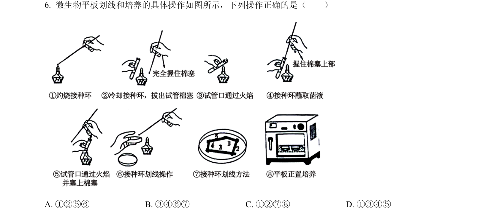
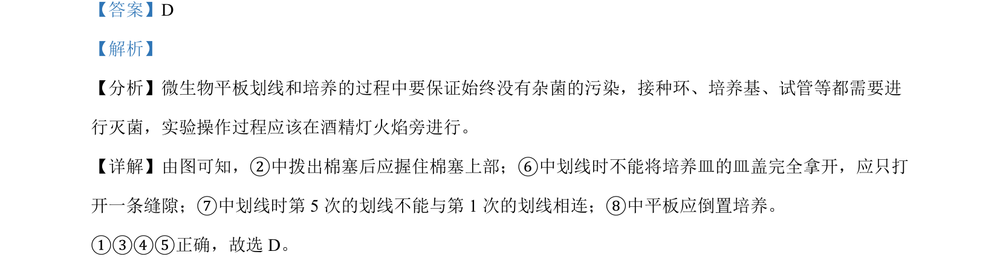

## 题面

## 摘要

考查微生物平板划线操作要点及噬菌体治疗的原理。

## 关联考点

- [[428-微生物培养|微生物培养]]
- [[594-平板划线法|平板划线法]]
- [[噬菌体侵染]]
- [[308-共同进化|协同进化]]

## 答案与解析

> 📄 原 PDF 第 4 页：`素材/真题/湖南/2008-2024·（湖南）生物高考真题/2024年高考生物试卷（湖南）（解析卷）.pdf`

<!-- 题干文本-start -->
## 题干文本
6. 微生物平板划线和培养的具体操作如图所示，下列操作正确的是（　　）
  
A. ①②⑤⑥ B. ③④⑥⑦ C. ①②⑦⑧ D. ①③④⑤
<!-- 题干文本-end -->

<!-- 解析文本-start -->
## 解析文本
【答案】D
【解析】
【分析】微生物平板划线和培养的过程中要保证始终没有杂菌的污染，接种环、培养基、试管等都需要进
行灭菌，实验操作过程应该在酒精灯火焰旁进行。
【详解】由图可知，②中拨出棉塞后应握住棉塞上部；⑥中划线时不能将培养皿的皿盖完全拿开，应只打
开一条缝隙；⑦中划线时第 5 次的划线不能与第 1 次的划线相连；⑧中平板应倒置培养。
①③④⑤正确，故选 D。
<!-- 解析文本-end -->
