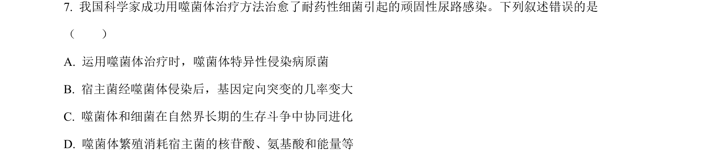
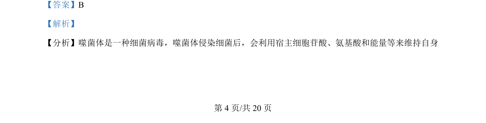
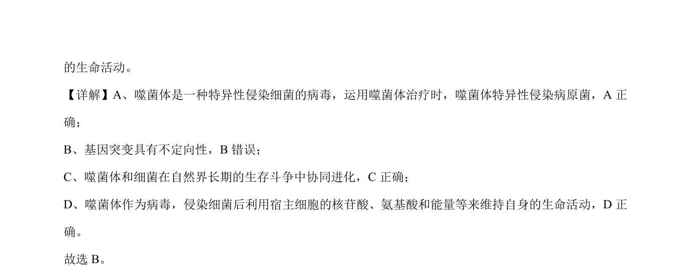

## 题面

## 摘要

该题考查噬菌体侵染细菌的特性及基因突变、协同进化等基础知识。

## 关联考点

- [[778-噬菌体|噬菌体]]
- [[特异性侵染]]
- [[301-基因突变|基因突变]]
- [[308-共同进化|协同进化]]

## 答案与解析

> 📄 原 PDF 第 4 页：`素材/真题/湖南/2008-2024·（湖南）生物高考真题/2024年高考生物试卷（湖南）（解析卷）.pdf`
