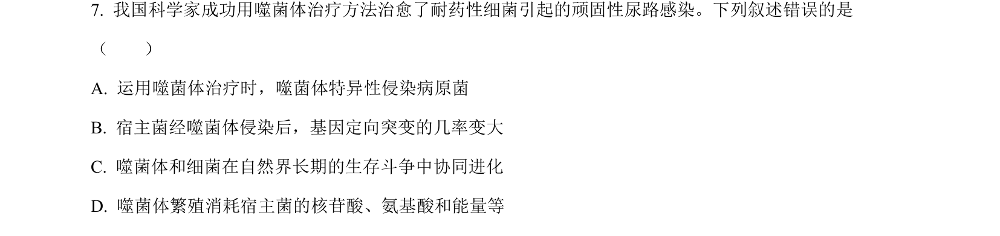
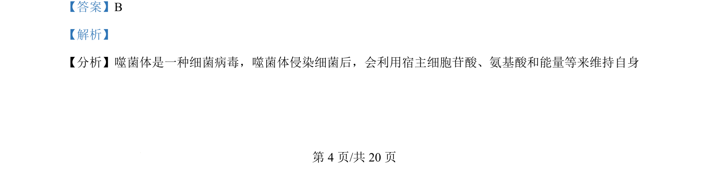
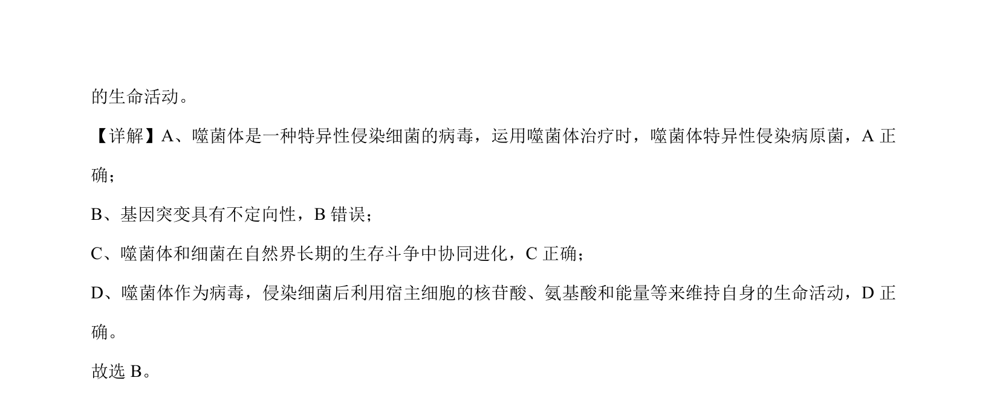

## 题面

## 摘要

该题考查噬菌体侵染细菌的特性及基因突变、协同进化等基础知识。

## 关联考点

- [[778-噬菌体|噬菌体]]
- [[特异性侵染]]
- [[301-基因突变|基因突变]]
- [[308-共同进化|协同进化]]

## 答案与解析

> 📄 原 PDF 第 4 页：`素材/真题/湖南/2008-2024·（湖南）生物高考真题/2024年高考生物试卷（湖南）（解析卷）.pdf`

<!-- 题干文本-start -->
## 题干文本
7. 我国科学家成功用噬菌体治疗方法治愈了耐药性细菌引起的顽固性尿路感染。下列叙述错误的是
（　　）
A. 运用噬菌体治疗时，噬菌体特异性侵染病原菌
B. 宿主菌经噬菌体侵染后，基因定向突变的几率变大
C. 噬菌体和细菌在自然界长期的生存斗争中协同进化
D. 噬菌体繁殖消耗宿主菌的核苷酸、氨基酸和能量等
<!-- 题干文本-end -->

<!-- 解析文本-start -->
## 解析文本
【答案】B
【解析】
【分析】噬菌体是一种细菌病毒，噬菌体侵染细菌后，会利用宿主细胞苷酸、氨基酸和能量等来维持自身
<!-- 解析文本-end -->
