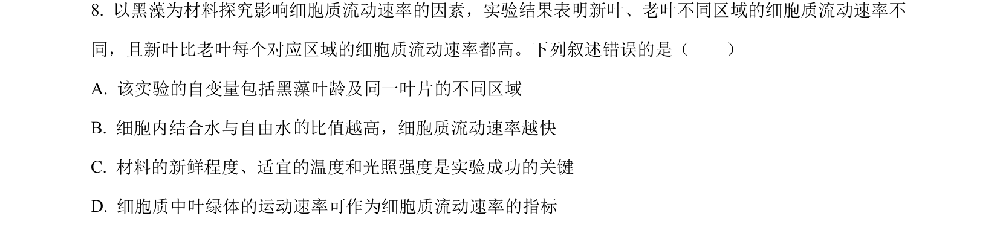
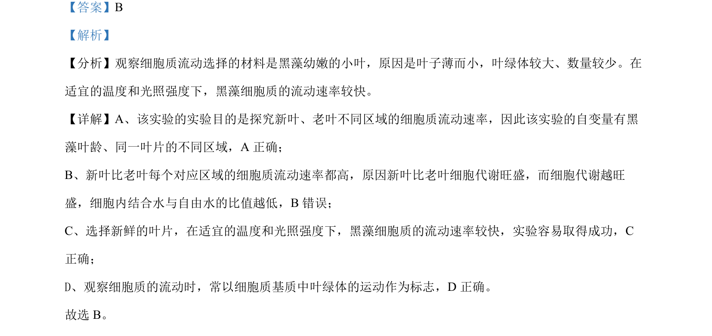

## 题面

## 摘要

探究黑藻叶龄与区域对细胞质流动速率的影响，考查实验变量、代谢与观察标志。

## 关联考点

- [[细胞质流动观察]]
- [[811-变量控制|实验变量]]
- [[691-自由水与结合水|自由水与结合水]]
- [[047-叶绿体|叶绿体]]

## 答案与解析

> 📄 原 PDF 第 5 页：`素材/真题/湖南/2008-2024·（湖南）生物高考真题/2024年高考生物试卷（湖南）（解析卷）.pdf`
