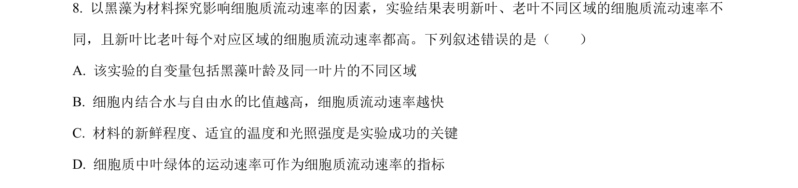
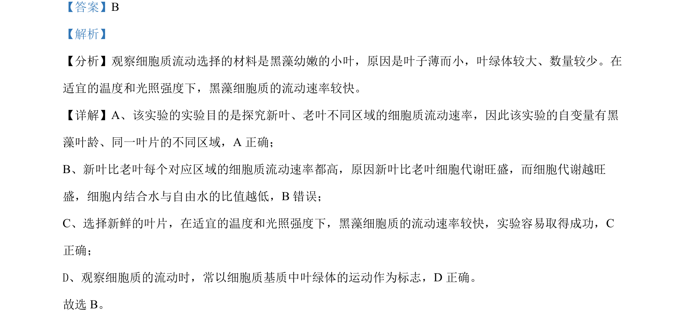

## 题面

## 摘要

探究黑藻叶龄与区域对细胞质流动速率的影响，考查实验变量、代谢与观察标志。

## 关联考点

- [[细胞质流动观察]]
- [[811-变量控制|实验变量]]
- [[691-自由水与结合水|自由水与结合水]]
- [[047-叶绿体|叶绿体]]

## 答案与解析

> 📄 原 PDF 第 5 页：`素材/真题/湖南/2008-2024·（湖南）生物高考真题/2024年高考生物试卷（湖南）（解析卷）.pdf`

<!-- 题干文本-start -->
## 题干文本
8. 以黑藻为材料探究影响细胞质流动速率的因素，实验结果表明新叶、老叶不同区域的细胞质流动速率不
同，且新叶比老叶每个对应区域的细胞质流动速率都高。下列叙述错误的是（　　）
A. 该实验的自变量包括黑藻叶龄及同一叶片的不同区域
B. 细胞内结合水与自由水 比值越高，细胞质流动速率越快
C. 材料的新鲜程度、适宜的温度和光照强度是实验成功的关键
D. 细胞质中叶绿体的运动速率可作为细胞质流动速率的指标
<!-- 题干文本-end -->

<!-- 解析文本-start -->
## 解析文本
【答案】B
【解析】
【分析】观察细胞质流动选择的材料是黑藻幼嫩的小叶，原因是叶子薄而小，叶绿体较大、数量较少。在
适宜的温度和光照强度下，黑藻细胞质的流动速率较快。
【详解】A、该实验的实验目的是探究新叶、老叶不同区域的细胞质流动速率，因此该实验的自变量有黑
藻叶龄、同一叶片的不同区域，A 正确；
B、新叶比老叶每个对应区域的细胞质流动速率都高，原因新叶比老叶细胞代谢旺盛，而细胞代谢越旺
盛，细胞内结合水与自由水的比值越低，B错误；
C、选择新鲜的叶片，在适宜的温度和光照强度下，黑藻细胞质的流动速率较快，实验容易取得成功，C
正确；
D、观察细胞质的流动时，常以细胞质基质中叶绿体的运动作为标志，D 正确。
故选 B。
<!-- 解析文本-end -->
