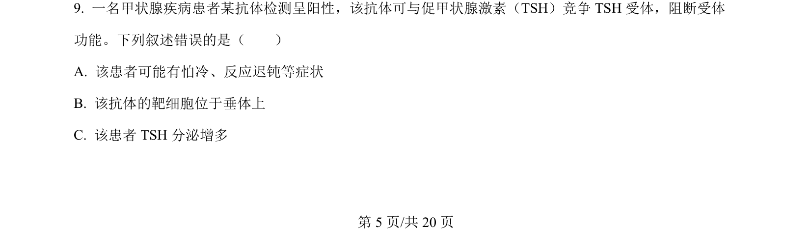
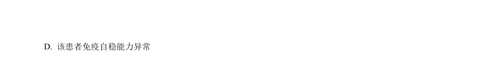
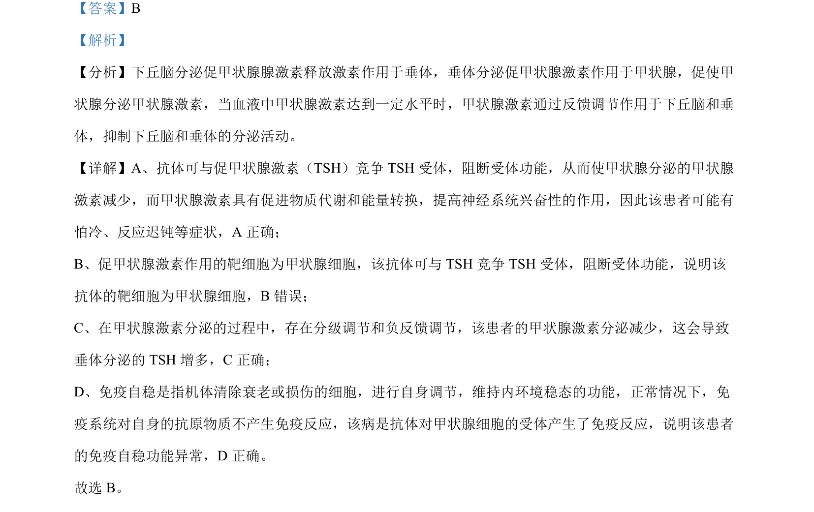

## 题面

## 摘要

考查甲状腺激素调节与自身免疫病，以及非酒精性脂肪肝的糖脂代谢分子机制。

## 关联考点

- [[甲状腺激素分级调节]]
- [[909-负反馈调节|负反馈调节]]
- [[免疫自稳]]
- [[脂肪肝形成机制]]

## 答案与解析

> 📄 原 PDF 第 5 页：`素材/真题/湖南/2008-2024·（湖南）生物高考真题/2024年高考生物试卷（湖南）（解析卷）.pdf`
