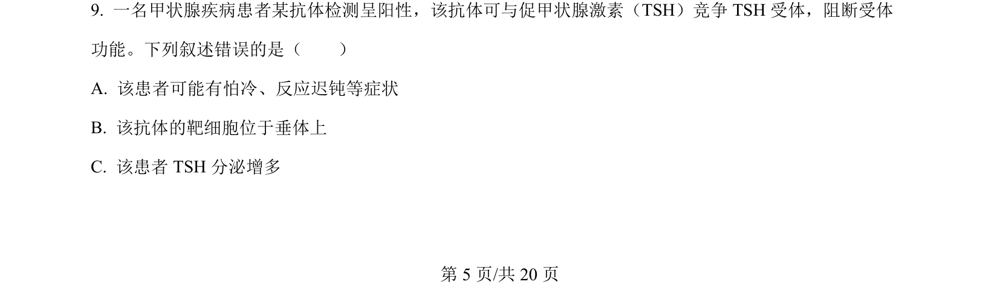
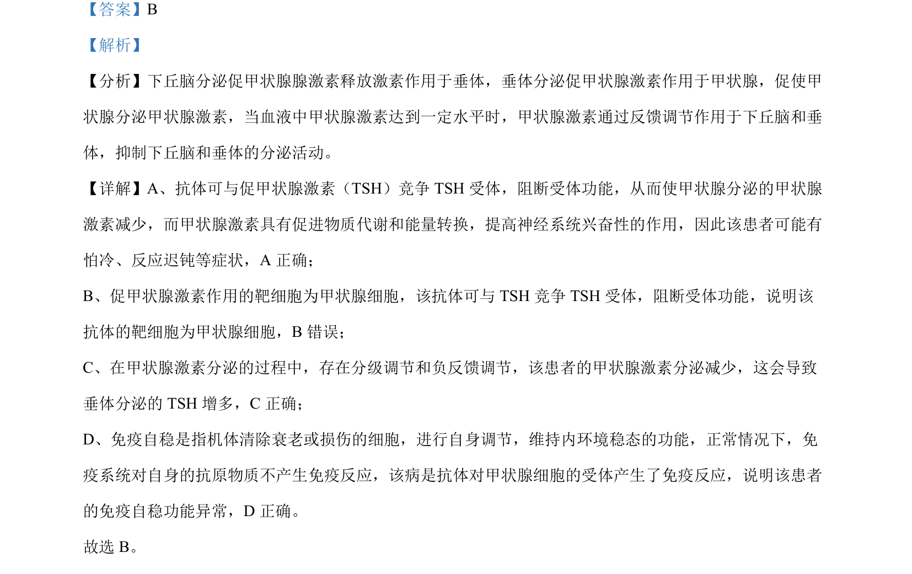

## 题面

## 摘要

考查甲状腺激素调节与自身免疫病，以及非酒精性脂肪肝的糖脂代谢分子机制。

## 关联考点

- [[甲状腺激素分级调节]]
- [[909-负反馈调节|负反馈调节]]
- [[免疫自稳]]
- [[脂肪肝形成机制]]

## 答案与解析

> 📄 原 PDF 第 5 页：`素材/真题/湖南/2008-2024·（湖南）生物高考真题/2024年高考生物试卷（湖南）（解析卷）.pdf`

<!-- 题干文本-start -->
## 题干文本
9. 一名甲状腺疾病患者某抗体检测呈阳性，该抗体可与促甲状腺激素（TSH）竞争 TSH 受体，阻断受体
功能。下列叙述错误的是（　　）
A. 该患者可能有怕冷、反应迟钝等症状
B. 该抗体的靶细胞位于垂体上
C. 该患者 TSH 分泌增多
的
<!-- 题干文本-end -->

<!-- 解析文本-start -->
## 解析文本

<!-- 解析文本-end -->
