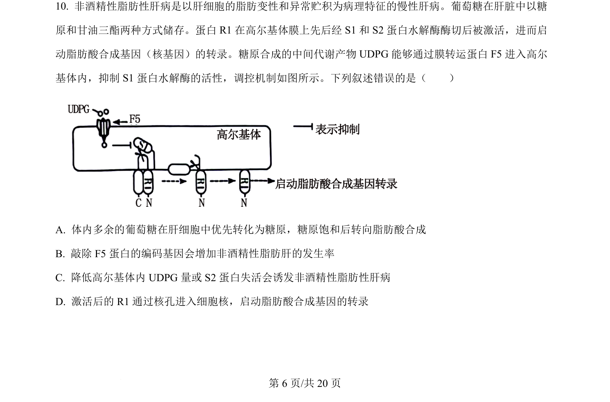
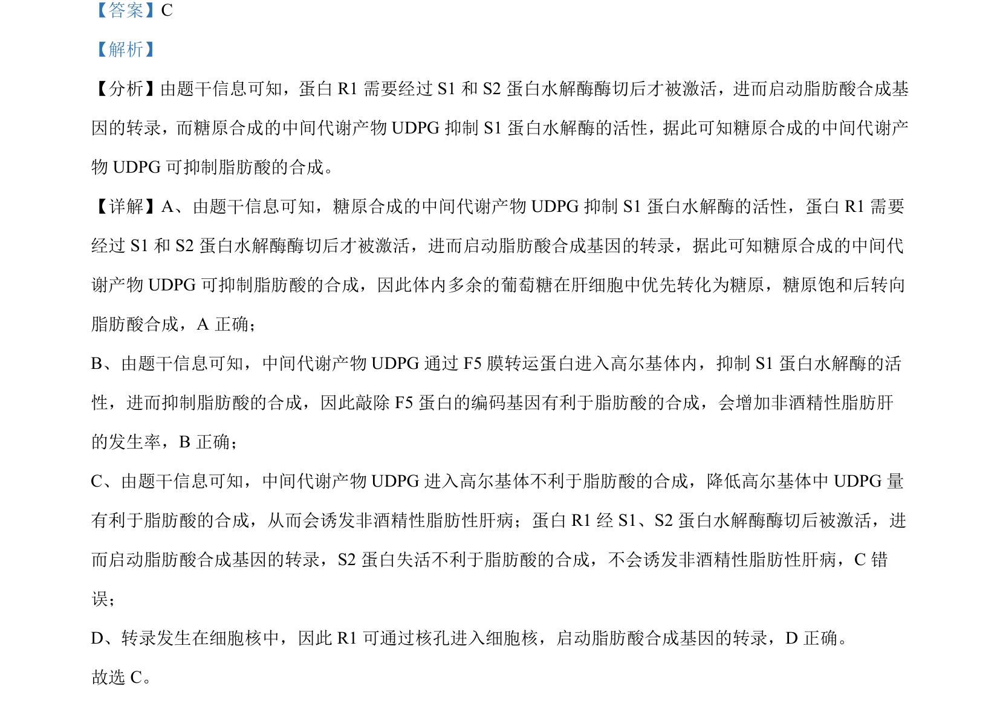

## 题面

## 摘要

该题考查渗透胁迫下ABA与基因R对水稻种子萌发的调节机制。

## 关联考点

- [[脱落酸（ABA）]]
- [[918-渗透胁迫|渗透胁迫]]
- [[015-种子萌发|种子萌发]]
- [[581-基因表达调控|基因表达调控]]

## 答案与解析

> 📄 原 PDF 第 6 页：`素材/真题/湖南/2008-2024·（湖南）生物高考真题/2024年高考生物试卷（湖南）（解析卷）.pdf`
