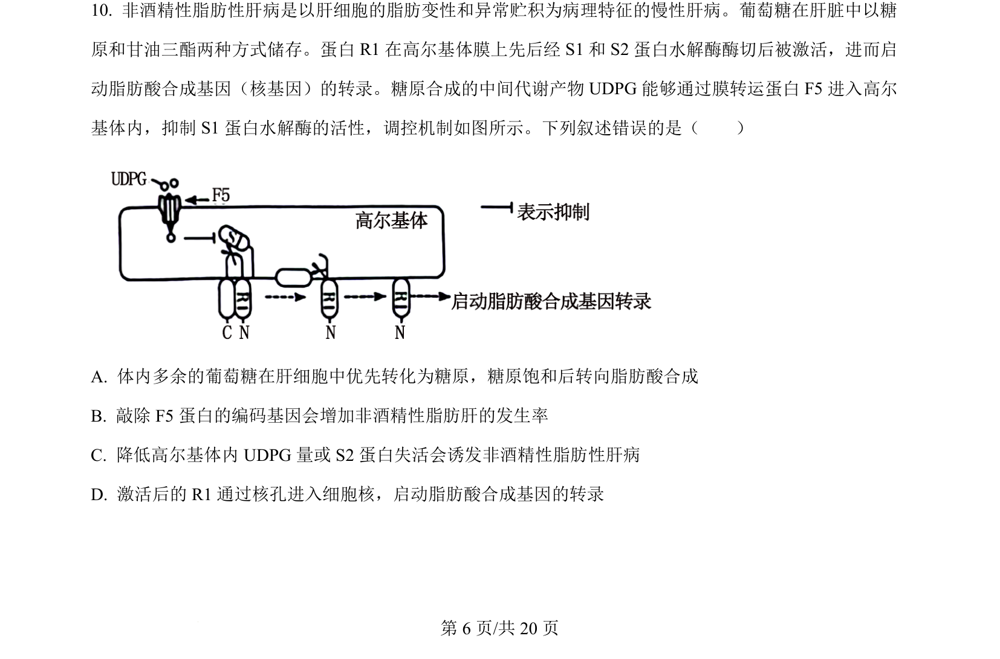
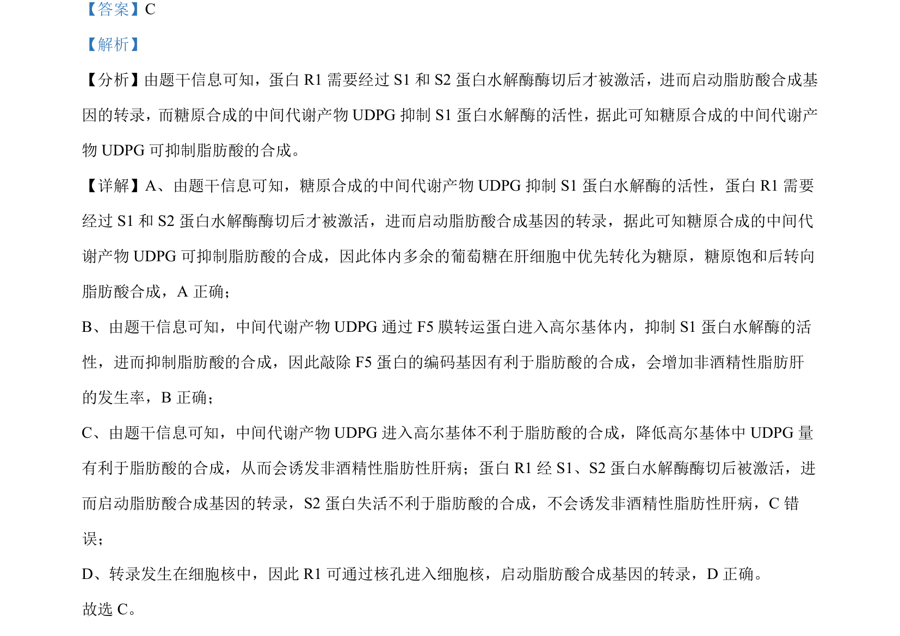

## 题面

## 摘要

该题考查渗透胁迫下ABA与基因R对水稻种子萌发的调节机制。

## 关联考点

- [[脱落酸（ABA）]]
- [[918-渗透胁迫|渗透胁迫]]
- [[015-种子萌发|种子萌发]]
- [[581-基因表达调控|基因表达调控]]

## 答案与解析

> 📄 原 PDF 第 6 页：`素材/真题/湖南/2008-2024·（湖南）生物高考真题/2024年高考生物试卷（湖南）（解析卷）.pdf`

<!-- 题干文本-start -->
## 题干文本
10. 非酒精性脂肪性肝病是以肝细胞的脂肪变性和异常贮积为病理特征的慢性肝病。葡萄糖在肝脏中以糖
原和甘油三酯两种方式储存。蛋白 R1在高尔基体膜上先后经 S1 和 S2 蛋白水解酶酶切后被激活，进而启
动脂肪酸合成基因（核基因）的转录。糖原合成的中间代谢产物 UDPG 能够通过膜转运蛋白 F5 进入高尔
基体内，抑制 S1 蛋白水解酶的活性，调控机制如图所示。下列叙述错误的是（　　）
  
A. 体内多余的葡萄糖在肝细胞中优先转化为糖原，糖原饱和后转向脂肪酸合成
B. 敲除 F5 蛋白的编码基因会增加非酒精性脂肪肝的发生率
C. 降低高尔基体内 UDPG 量或 S2 蛋白失活会诱发非酒精性脂肪性肝病
D. 激活后的 R1通过核孔进入细胞核，启动脂肪酸合成基因的转录
<!-- 题干文本-end -->

<!-- 解析文本-start -->
## 解析文本

<!-- 解析文本-end -->
