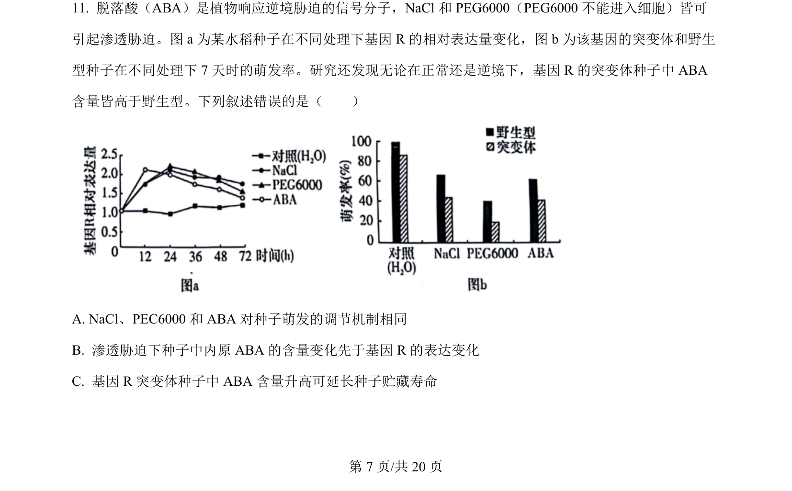
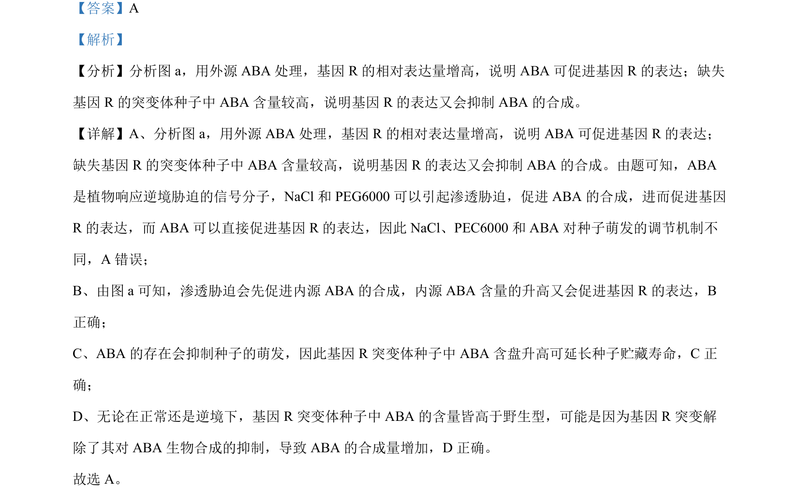

## 题面

## 摘要

ABA与基因R相互调控影响种子萌发，涉及渗透胁迫和激素信号转导。

## 关联考点

- [[脱落酸(ABA)]]
- [[581-基因表达调控|基因表达调控]]
- [[918-渗透胁迫|渗透胁迫]]
- [[015-种子萌发|种子萌发]]

## 答案与解析

> 📄 原 PDF 第 7 页：`素材/真题/湖南/2008-2024·（湖南）生物高考真题/2024年高考生物试卷（湖南）（解析卷）.pdf`
