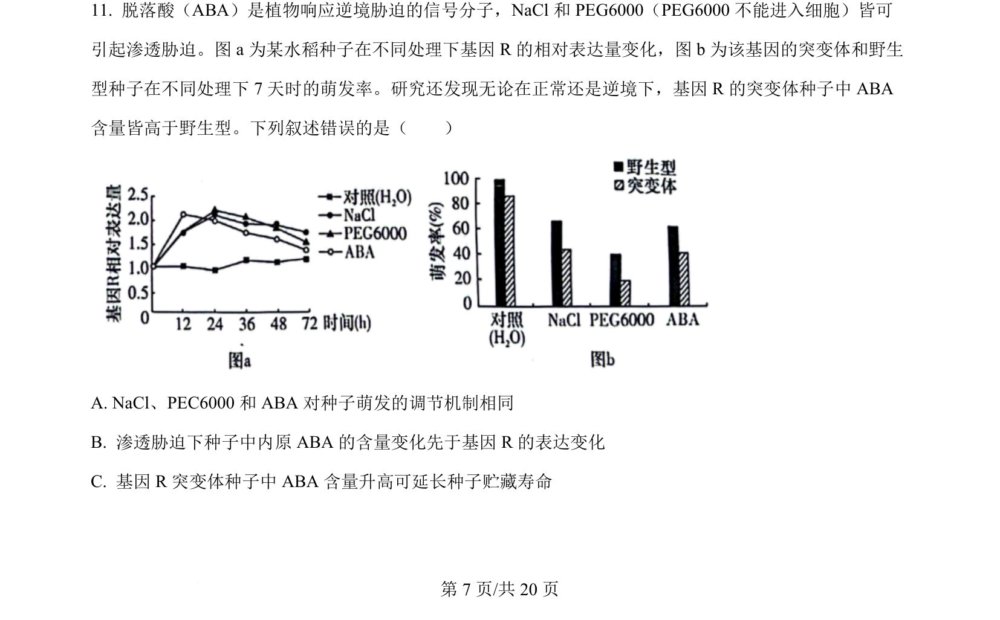
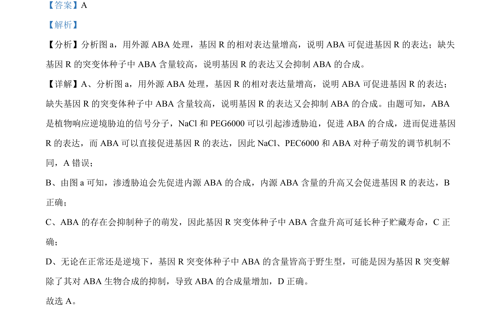

## 题面

## 摘要

ABA与基因R相互调控影响种子萌发，涉及渗透胁迫和激素信号转导。

## 关联考点

- [[脱落酸(ABA)]]
- [[581-基因表达调控|基因表达调控]]
- [[918-渗透胁迫|渗透胁迫]]
- [[015-种子萌发|种子萌发]]

## 答案与解析

> 📄 原 PDF 第 7 页：`素材/真题/湖南/2008-2024·（湖南）生物高考真题/2024年高考生物试卷（湖南）（解析卷）.pdf`

<!-- 题干文本-start -->
## 题干文本
11. 脱落酸（ABA）是植物响应逆境胁迫的信号分子，NaCl和 PEG6000（PEG6000 不能进入细胞）皆可
引起渗透胁迫。图 a为某水稻种子在不同处理下基因 R的相对表达量变化，图 b 为该基因的突变体和野生
型种子在不同处理下 7 天时的萌发率。研究还发现无论在正常还是逆境下，基因 R的突变体种子中 ABA
含量皆高于野生型。下列叙述错误的是（　　）
A. NaCl、PEC6000和 ABA 对种子萌发的调节机制相同
B. 渗透胁迫下种子中内原 ABA 的含量变化先于基因 R的表达变化
C. 基因 R突变体种子中 ABA 含量升高可延长种子贮藏寿命
<!-- 题干文本-end -->

<!-- 解析文本-start -->
## 解析文本

<!-- 解析文本-end -->
