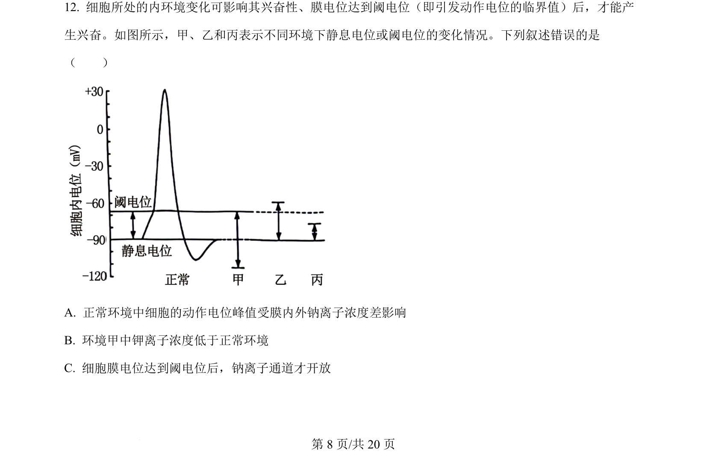
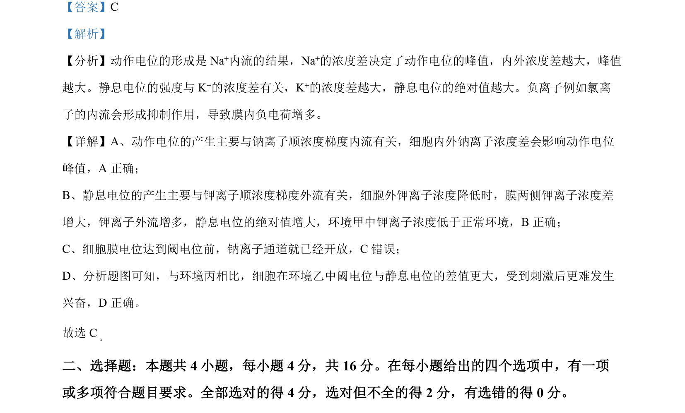

## 题面

## 摘要

本题以动作电位和静息电位的离子基础为背景，考查兴奋产生与传导机制及实验分析。

## 关联考点

- [[318-动作电位|动作电位]]
- [[329-静息电位|静息电位]]
- [[钠离子通道]]
- [[阈电位]]

## 答案与解析

> 📄 原 PDF 第 8 页：`素材/真题/湖南/2008-2024·（湖南）生物高考真题/2024年高考生物试卷（湖南）（解析卷）.pdf`
