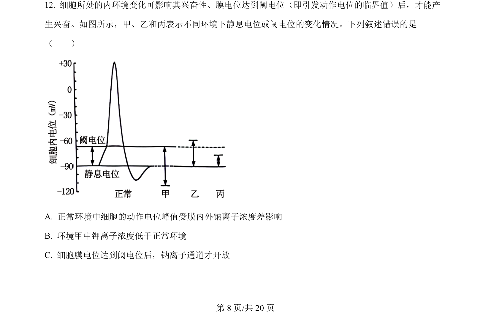
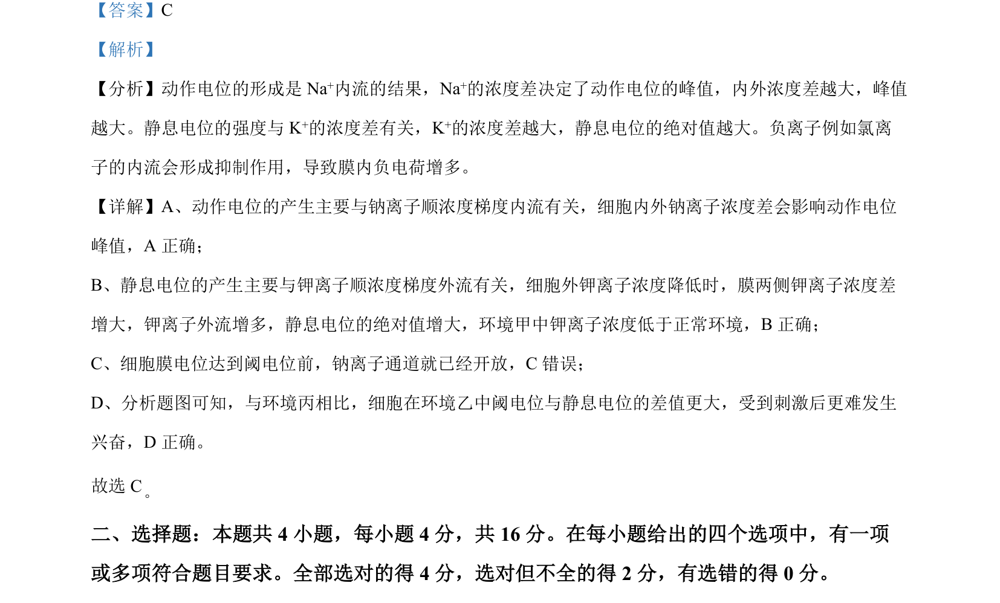

## 题面

## 摘要

本题以动作电位和静息电位的离子基础为背景，考查兴奋产生与传导机制及实验分析。

## 关联考点

- [[318-动作电位|动作电位]]
- [[329-静息电位|静息电位]]
- [[钠离子通道]]
- [[阈电位]]

## 答案与解析

> 📄 原 PDF 第 8 页：`素材/真题/湖南/2008-2024·（湖南）生物高考真题/2024年高考生物试卷（湖南）（解析卷）.pdf`

<!-- 题干文本-start -->
## 题干文本
12. 细胞所处的内环境变化可影响其兴奋性、膜电位达到阈电位（即引发动作电位的临界值）后，才能产
生兴奋。如图所示，甲、乙和丙表示不同环境下静息电位或阈电位的变化情况。下列叙述错误的是
（　　）
  
A. 正常环境中细胞的动作电位峰值受膜内外钠离子浓度差影响
B. 环境甲中钾离子浓度低于正常环境
C. 细胞膜电位达到阈电位后，钠离子通道才开放
<!-- 题干文本-end -->

<!-- 解析文本-start -->
## 解析文本

<!-- 解析文本-end -->
