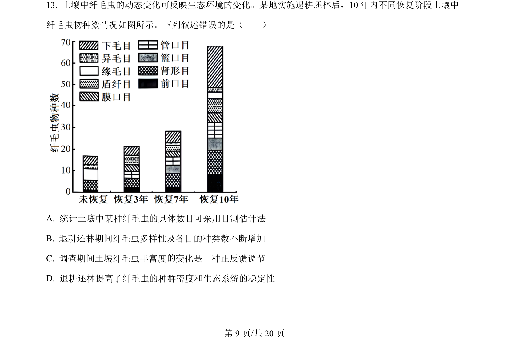
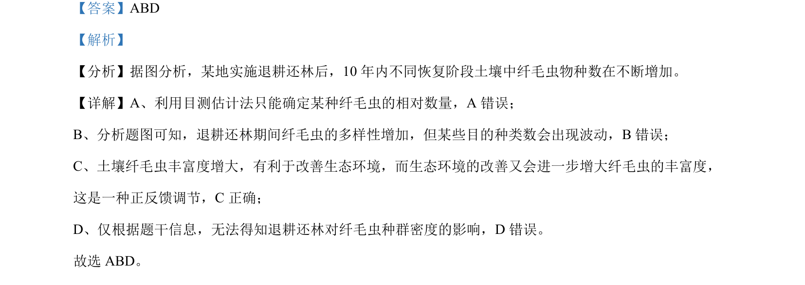

## 题面

## 摘要

退耕还林后纤毛虫物种数变化与群落演替、丰富度及反馈调节的关系

## 关联考点

- [[407-群落演替|群落演替]]
- [[911-丰富度|丰富度]]
- [[正反馈调节]]
- [[目测估计法]]

## 答案与解析

> 📄 原 PDF 第 9 页：`素材/真题/湖南/2008-2024·（湖南）生物高考真题/2024年高考生物试卷（湖南）（解析卷）.pdf`
