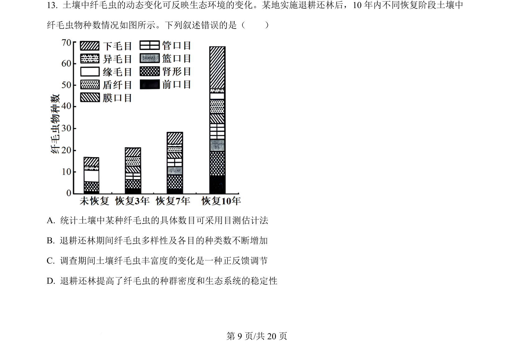
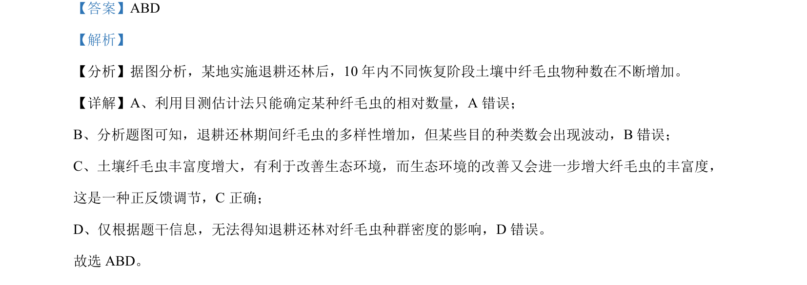

## 题面

## 摘要

退耕还林后纤毛虫物种数变化与群落演替、丰富度及反馈调节的关系

## 关联考点

- [[407-群落演替|群落演替]]
- [[911-丰富度|丰富度]]
- [[正反馈调节]]
- [[目测估计法]]

## 答案与解析

> 📄 原 PDF 第 9 页：`素材/真题/湖南/2008-2024·（湖南）生物高考真题/2024年高考生物试卷（湖南）（解析卷）.pdf`

<!-- 题干文本-start -->
## 题干文本
13. 土壤中纤毛虫的动态变化可反映生态环境的变化。某地实施退耕还林后，10 年内不同恢复阶段土壤中
纤毛虫物种数情况如图所示。下列叙述错误的是（　　）
A. 统计土壤中某种纤毛虫的具体数目可采用目测估计法
B. 退耕还林期间纤毛虫多样性及各目的种类数不断增加
C. 调查期间土壤纤毛虫丰富度 变化是一种正反馈调节
D. 退耕还林提高了纤毛虫的种群密度和生态系统的稳定性
。
的
<!-- 题干文本-end -->

<!-- 解析文本-start -->
## 解析文本

<!-- 解析文本-end -->
