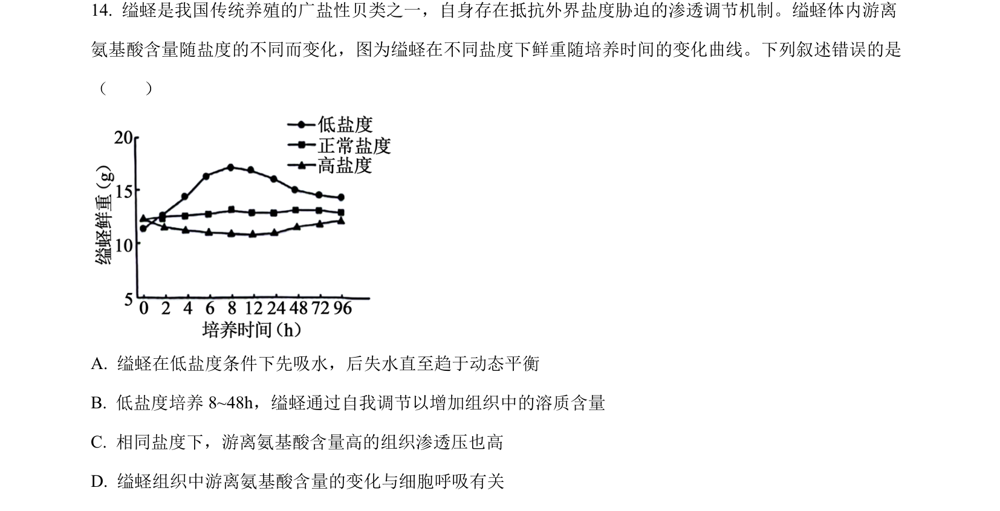
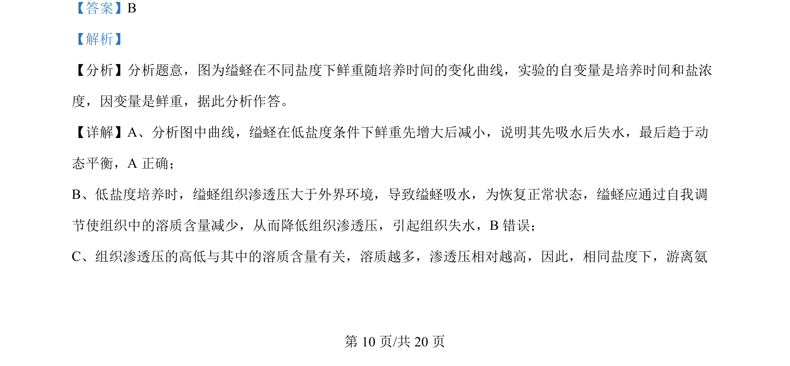
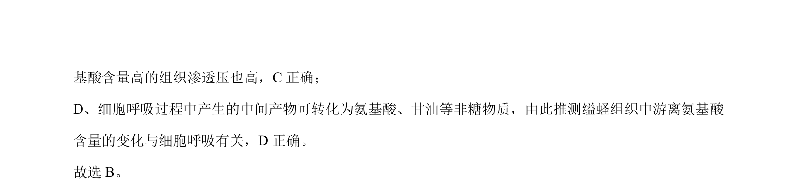

## 题面

## 摘要

探究缢蛏在不同盐度下鲜重变化及渗透压调节机制

## 关联考点

- [[渗透压调节]]
- [[自由氨基酸]]
- [[241-细胞呼吸|细胞呼吸]]
- [[盐度对生物的影响]]

## 答案与解析

> 📄 原 PDF 第 10 页：`素材/真题/湖南/2008-2024·（湖南）生物高考真题/2024年高考生物试卷（湖南）（解析卷）.pdf`

<!-- 题干文本-start -->
## 题干文本
14. 缢蛏是我国传统养殖的广盐性贝类之一，自身存在抵抗外界盐度胁迫的渗透调节机制。缢蛏体内游离
氨基酸含量随盐度的不同而变化，图为缢蛏在不同盐度下鲜重随培养时间的变化曲线。下列叙述错误的是
（　　）
A. 缢蛏在低盐度条件下先吸水，后失水直至趋于动态平衡
B. 低盐度培养 8~48h，缢蛏通过自我调节以增加组织中的溶质含量
C. 相同盐度下，游离氨基酸含量高的组织渗透压也高
D. 缢蛏组织中游离氨基酸含量的变化与细胞呼吸有关
<!-- 题干文本-end -->

<!-- 解析文本-start -->
## 解析文本
【答案】B
【解析】
【分析】分析题意，图为缢蛏在不同盐度下鲜重随培养时间的变化曲线，实验的自变量是培养时间和盐浓
度，因变量是鲜重，据此分析作答。
【详解】A、分析图中曲线，缢蛏在低盐度条件下鲜重先增大后减小，说明其先吸水后失水，最后趋于动
态平衡，A 正确；
B、低盐度培养时，缢蛏组织渗透压大于外界环境，导致缢蛏吸水，为恢复正常状态，缢蛏应通过自我调
节使组织中的溶质含量减少，从而降低组织渗透压，引起组织失水，B错误；
C、组织渗透压的高低与其中的溶质含量有关，溶质越多，渗透压相对越高，因此，相同盐度下，游离氨
<!-- 解析文本-end -->
