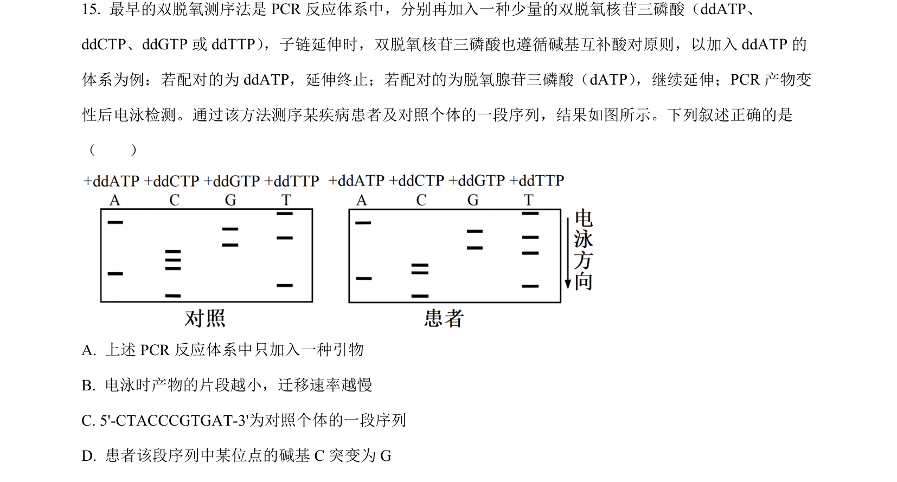
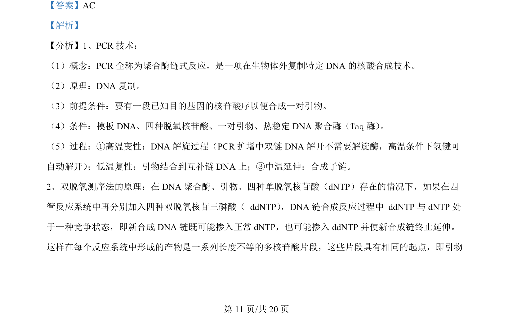
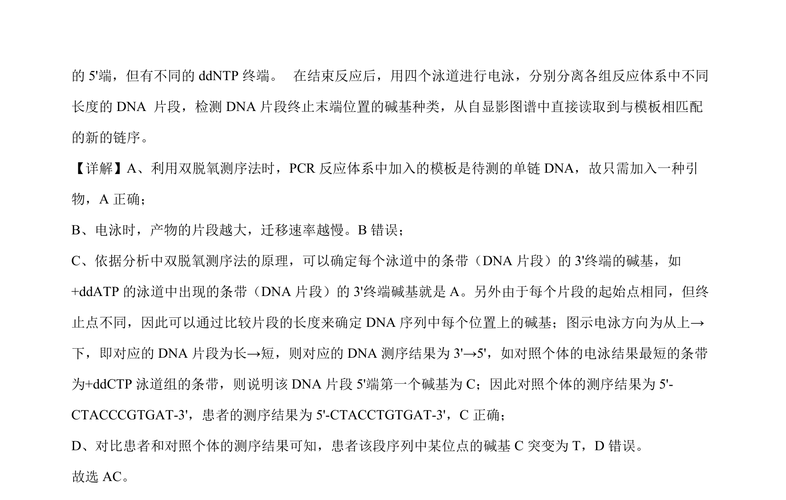

## 题面

## 摘要

本题考查双脱氧测序法的原理、PCR及电泳结果分析。

## 关联考点

- [[410-PCR|PCR]]
- [[双脱氧测序法]]
- [[DNA电泳]]
- [[301-基因突变|基因突变]]

## 答案与解析

> 📄 原 PDF 第 11 页：`素材/真题/湖南/2008-2024·（湖南）生物高考真题/2024年高考生物试卷（湖南）（解析卷）.pdf`
