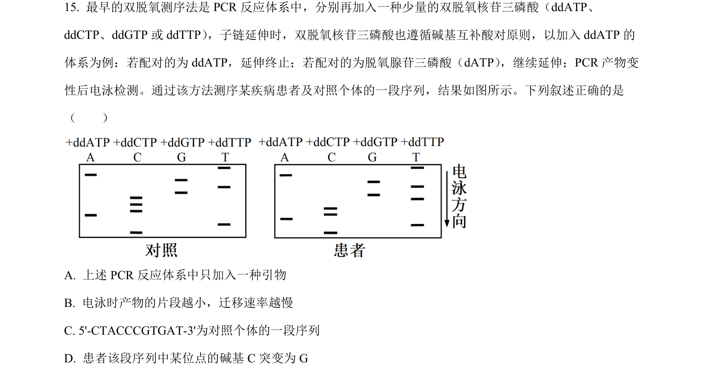
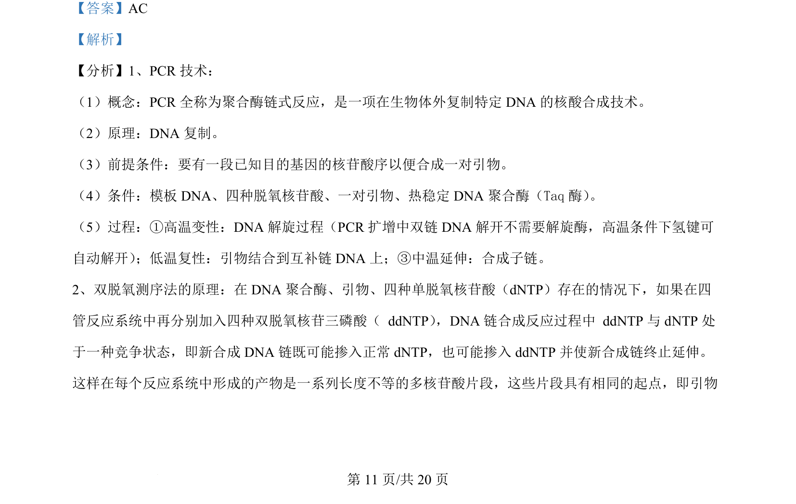
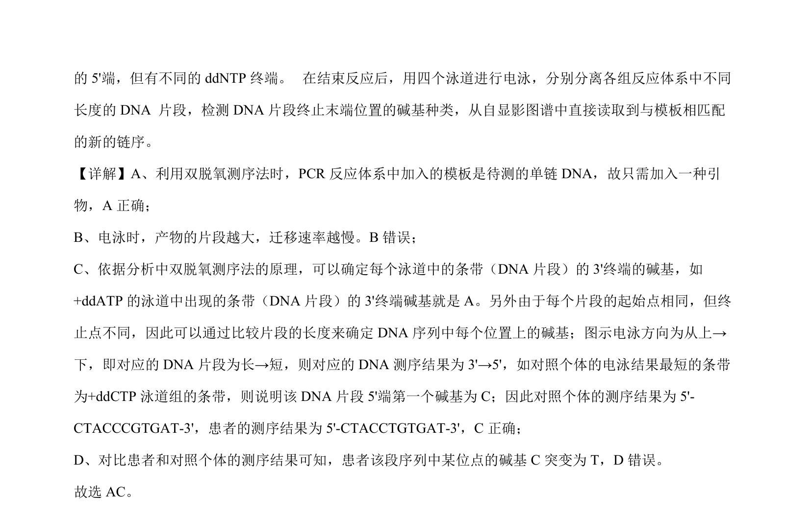

## 题面

## 摘要

本题考查双脱氧测序法的原理、PCR及电泳结果分析。

## 关联考点

- [[410-PCR|PCR]]
- [[双脱氧测序法]]
- [[DNA电泳]]
- [[301-基因突变|基因突变]]

## 答案与解析

> 📄 原 PDF 第 11 页：`素材/真题/湖南/2008-2024·（湖南）生物高考真题/2024年高考生物试卷（湖南）（解析卷）.pdf`

<!-- 题干文本-start -->
## 题干文本
15. 最早的双脱氧测序法是 PCR 反应体系中，分别再加入一种少量的双脱氧核苷三磷酸（ddATP、
ddCTP、ddGTP 或 ddTTP） ，子链延伸时，双脱氧核苷三磷酸也遵循碱基互补酸对原则，以加入ddATP 的
体系为例：若配对的为 ddATP，延伸终止；若配对的为脱氧腺苷三磷酸（dATP） ，继续延伸；PCR 产物变
性后电泳检测。通过该方法测序某疾病患者及对照个体的一段序列，结果如图所示。下列叙述正确的是
（　　）
A. 上述 PCR 反应体系中只加入一种引物
B. 电泳时产物的片段越小，迁移速率越慢
C. 5'-CTACCCGTGAT-3'为对照个体的一段序列
D. 患者该段序列中某位点的碱基 C突变为 G
<!-- 题干文本-end -->

<!-- 解析文本-start -->
## 解析文本
【答案】AC
【解析】
【分析】1、PCR 技术：
（1）概念：PCR 全称为聚合酶链式反应，是一项在生物体外复制特定 DNA 的核酸合成技术。
（2）原理：DNA 复制。
（3）前提条件：要有一段已知目的基因的核苷酸序以便合成一对引物。
（4）条件：模板 DNA、四种脱氧核苷酸、一对引物、热稳定 DNA 聚合酶（Taq酶） 。
（5）过程：①高温变性：DNA 解旋过程（PCR 扩增中双链 DNA 解开不需要解旋酶，高温条件下氢键可
自动解开） ；低温复性：引物结合到互补链DNA 上；③中温延伸：合成子链。
2、双脱氧测序法的原理：在 DNA 聚合酶、引物、四种单脱氧核苷酸（dNTP）存在的情况下，如果在四
管反应系统中再分别加入四种双脱氧核苷三磷酸（ ddNTP ） ，DNA 链合成反应过程中 ddNTP 与 dNTP 处
于一种竞争状态，即新合成 DNA 链既可能掺入正常 dNTP，也可能掺入 ddNTP 并使新合成链终止延伸。
这样在每个反应系统中形成的产物是一系列长度不等的多核苷酸片段，这些片段具有相同的起点，即引物
<!-- 解析文本-end -->
