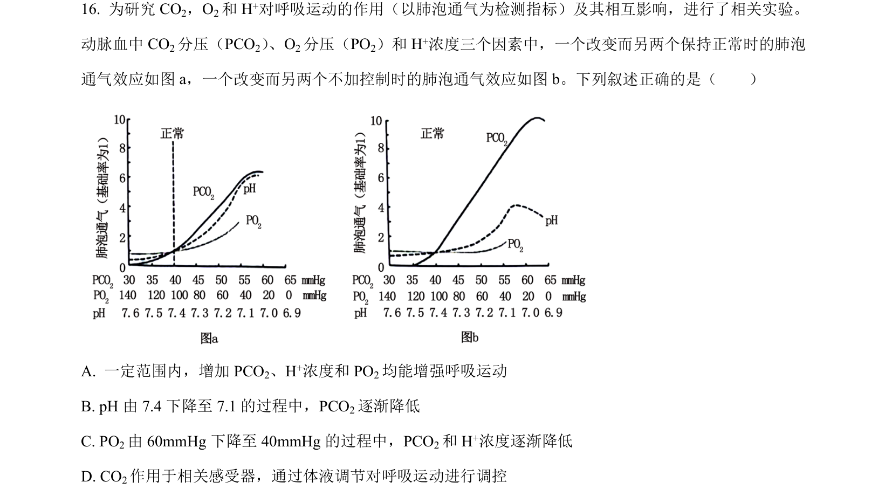
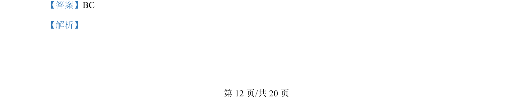
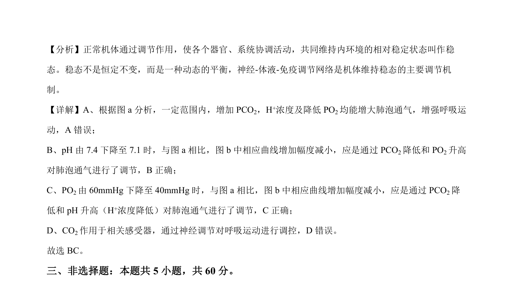

## 题面

## 摘要

本题结合图表考查内环境稳态与呼吸调节及缺钾对光合作用的影响，包括分子机制和实验探究。

## 关联考点

- [[314-内环境稳态|内环境稳态]]
- [[324-神经调节|神经调节]]
- [[033-光合作用|光合作用]]
- [[301-基因突变|基因突变]]

## 答案与解析

> 📄 原 PDF 第 12 页：`素材/真题/湖南/2008-2024·（湖南）生物高考真题/2024年高考生物试卷（湖南）（解析卷）.pdf`
