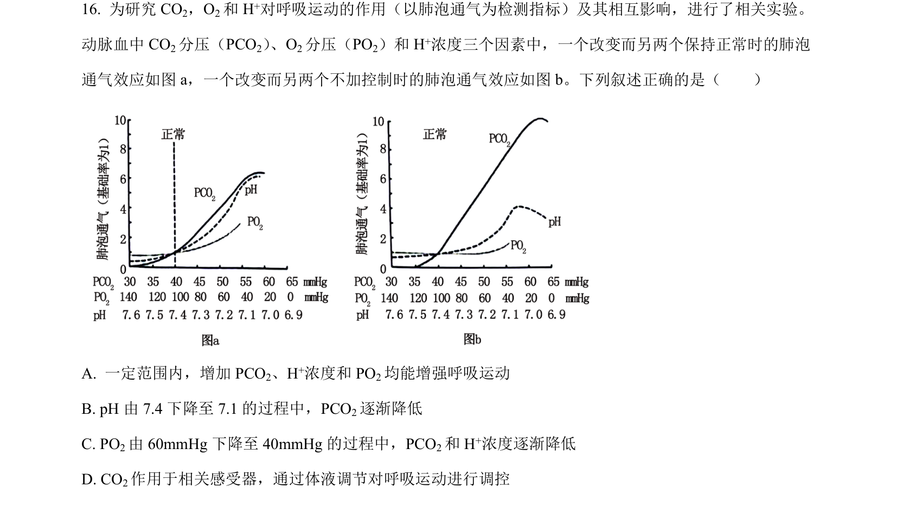
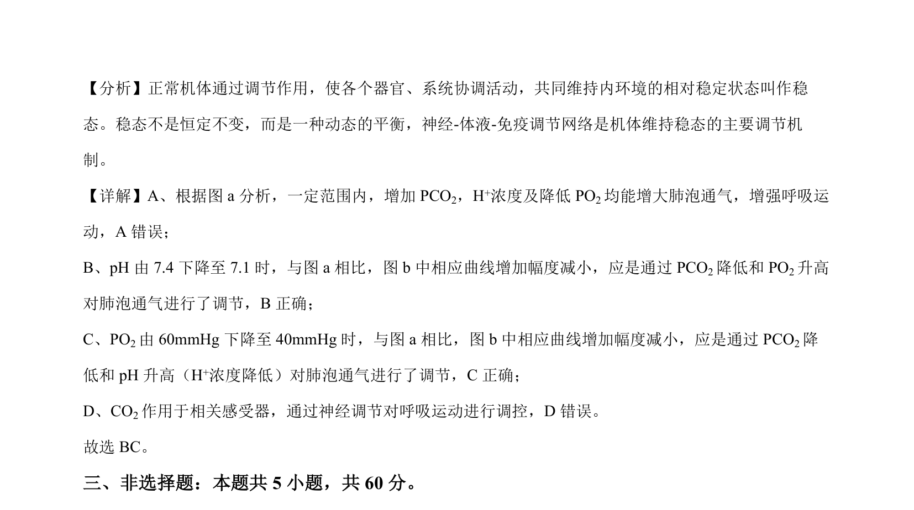

## 题面

## 摘要

本题结合图表考查内环境稳态与呼吸调节及缺钾对光合作用的影响，包括分子机制和实验探究。

## 关联考点

- [[314-内环境稳态|内环境稳态]]
- [[324-神经调节|神经调节]]
- [[033-光合作用|光合作用]]
- [[301-基因突变|基因突变]]

## 答案与解析

> 📄 原 PDF 第 12 页：`素材/真题/湖南/2008-2024·（湖南）生物高考真题/2024年高考生物试卷（湖南）（解析卷）.pdf`

<!-- 题干文本-start -->
## 题干文本
16. 为研究 CO2，O2和 H+对呼吸运动的作用（以肺泡通气为检测指标）及其相互影响，进行了相关实验。
动脉血中 CO2分压（PCO2） 、O2分压（PO2）和 H+浓度三个因素中，一个改变而另两个保持正常时的肺泡
通气效应如图 a，一个改变而另两个不加控制时的肺泡通气效应如图 b。下列叙述正确的是（　　）
A. 一定范围内，增加 PCO2、H+浓度和 PO2均能增强呼吸运动
B. pH 由 7.4 下降至 7.1 的过程中，PCO2逐渐降低
C. PO2由 60mmHg下降至 40mmHg的过程中，PCO2和 H+浓度逐渐降低
D. CO2作用于相关感受器，通过体液调节对呼吸运动进行调控
<!-- 题干文本-end -->

<!-- 解析文本-start -->
## 解析文本
【答案】BC
【解析】
<!-- 解析文本-end -->
