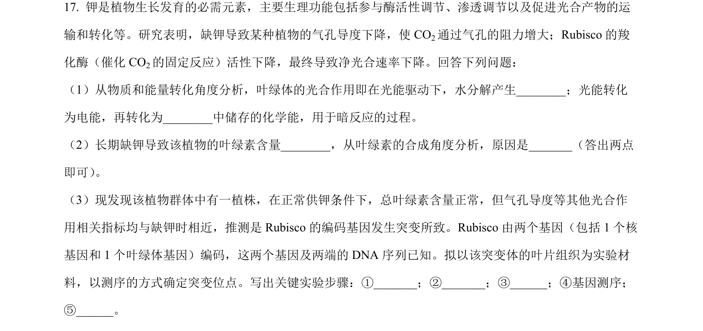
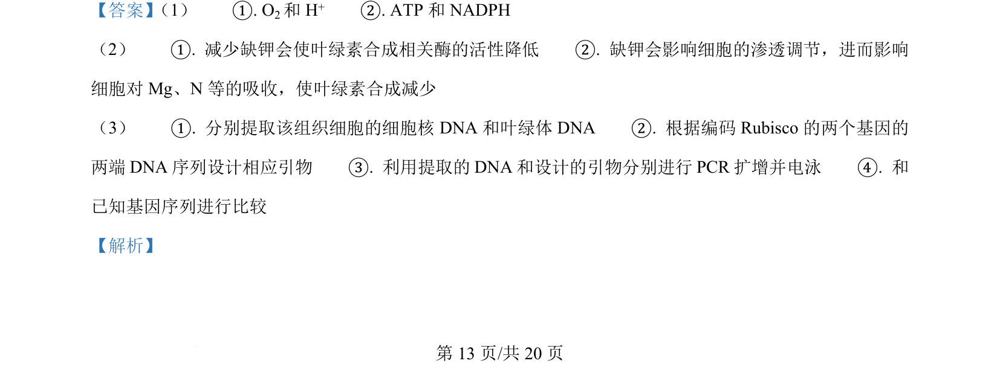
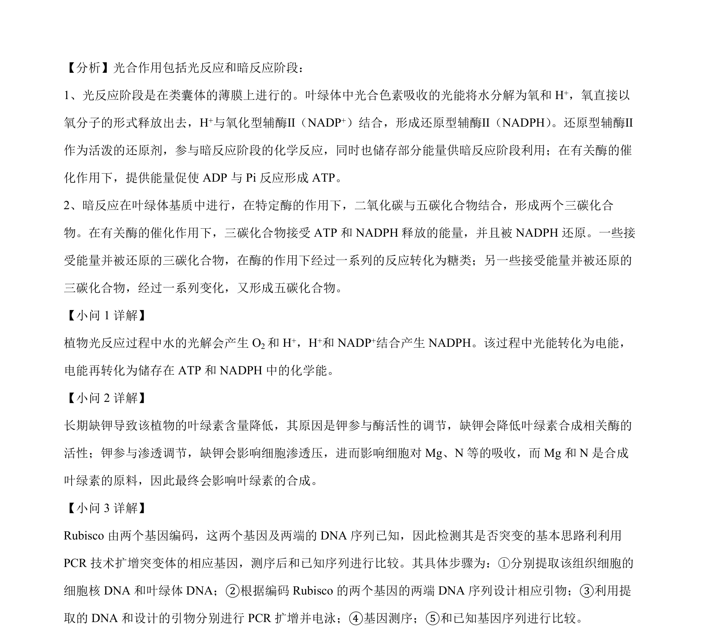

## 题面

## 摘要

一绿色盲男性与红色盲女性婚配，考查伴X隐性遗传及蓝色盲常染色体显性遗传，并结合酶切图谱推断基因组成。

## 关联考点

- [[伴X染色体隐性遗传]]
- [[301-基因突变|基因突变]]
- [[限制酶图谱分析]]

## 答案与解析

> 📄 原 PDF 第 13 页：`素材/真题/湖南/2008-2024·（湖南）生物高考真题/2024年高考生物试卷（湖南）（解析卷）.pdf`
