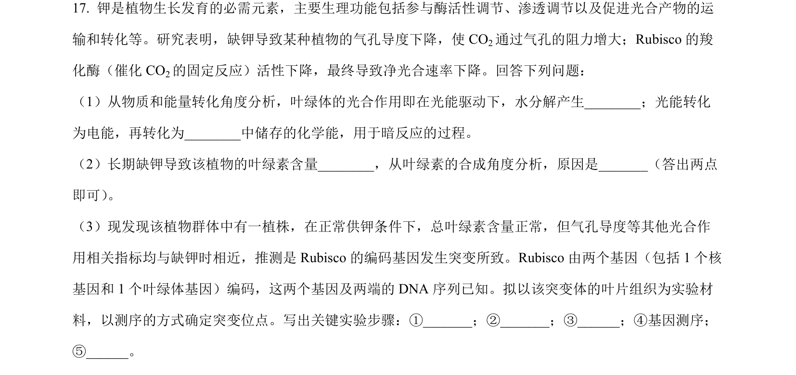
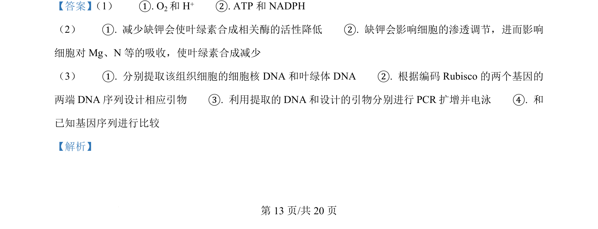
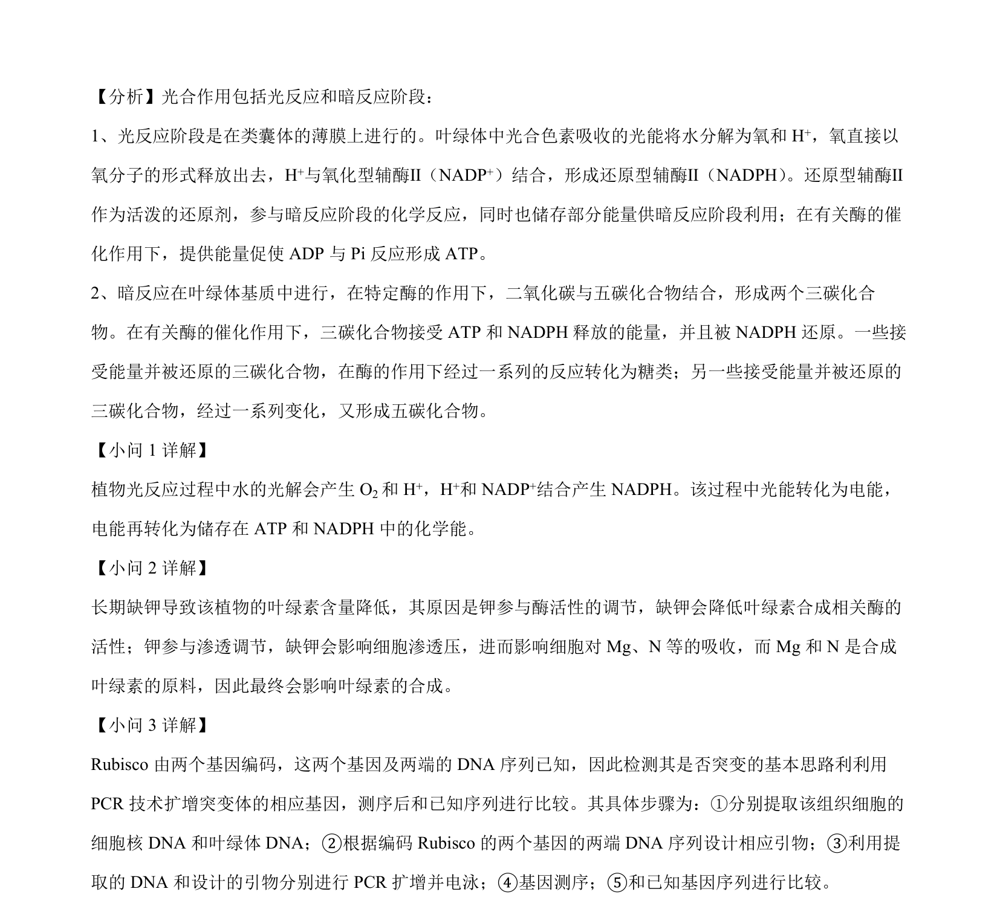

## 题面

## 摘要

一绿色盲男性与红色盲女性婚配，考查伴X隐性遗传及蓝色盲常染色体显性遗传，并结合酶切图谱推断基因组成。

## 关联考点

- [[伴X染色体隐性遗传]]
- [[301-基因突变|基因突变]]
- [[限制酶图谱分析]]

## 答案与解析

> 📄 原 PDF 第 13 页：`素材/真题/湖南/2008-2024·（湖南）生物高考真题/2024年高考生物试卷（湖南）（解析卷）.pdf`

<!-- 题干文本-start -->
## 题干文本
17. 钾是植物生长发育的必需元素，主要生理功能包括参与酶活性调节、渗透调节以及促进光合产物的运
输和转化等。研究表明，缺钾导致某种植物的气孔导度下降，使 CO2通过气孔的阻力增大；Rubisco的羧
化酶（催化 CO2的固定反应）活性下降，最终导致净光合速率下降。回答下列问题：
（1）从物质和能量转化角度分析，叶绿体的光合作用即在光能驱动下，水分解产生________；光能转化
为电能，再转化为________中储存的化学能，用于暗反应的过程。
（2）长期缺钾导致该植物的叶绿素含量________，从叶绿素的合成角度分析，原因是_______（答出两点
即可） 。
（3）现发现该植物群体中有一植株，在正常供钾条件下，总叶绿素含量正常，但气孔导度等其他光合作
用相关指标均与缺钾时相近，推测是 Rubisco的编码基因发生突变所致。Rubisco由两个基因（包括 1个核
基因和 1 个叶绿体基因）编码，这两个基因及两端的 DNA 序列已知。拟以该突变体的叶片组织为实验材
料，以测序的方式确定突变位点。写出关键实验步骤：①_______；②_______；③______；④基因测序；
⑤______。
<!-- 题干文本-end -->

<!-- 解析文本-start -->
## 解析文本
【答案】 （1）    ①. O2和 H+    ②. ATP 和 NADPH    
（2）    ①. 减少缺钾会使叶绿素合成相关酶的活性降低    ②. 缺钾会影响细胞的渗透调节，进而影响
细胞对 Mg、N 等的吸收，使叶绿素合成减少    
（3）    ①. 分别提取该组织细胞的细胞核 DNA 和叶绿体 DNA    ②. 根据编码 Rubisco 的两个基因的
两端 DNA序列设计相应引物    ③. 利用提取的 DNA和设计的引物分别进行 PCR扩增并电泳    ④. 和
已知基因序列进行比较
【解析】
<!-- 解析文本-end -->
