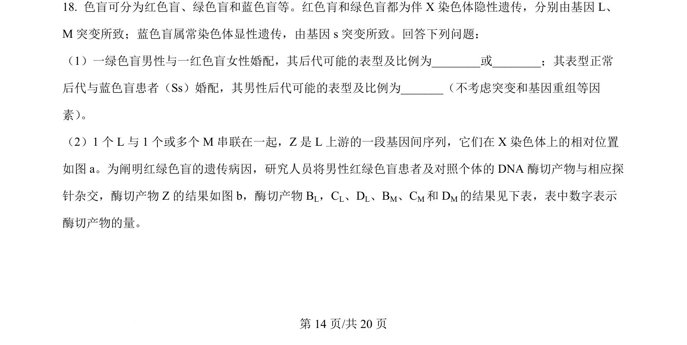
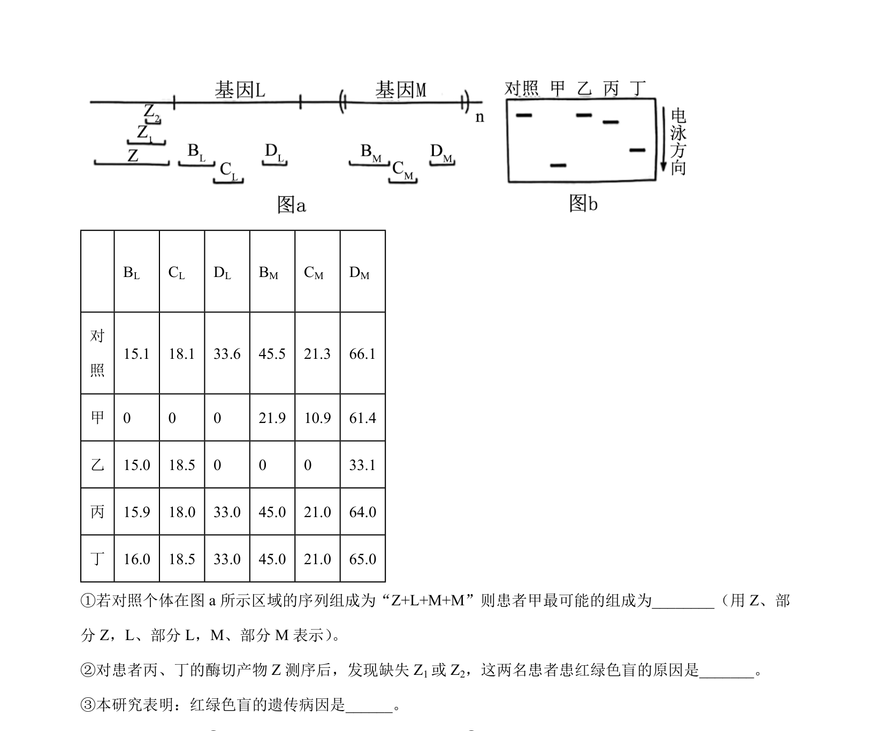
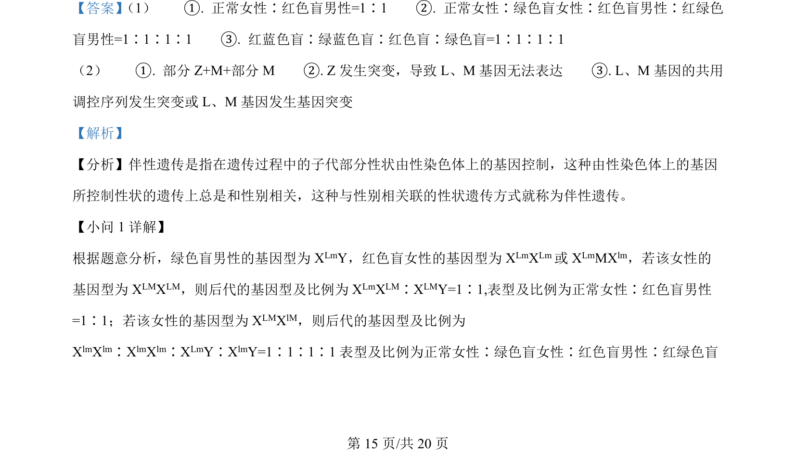
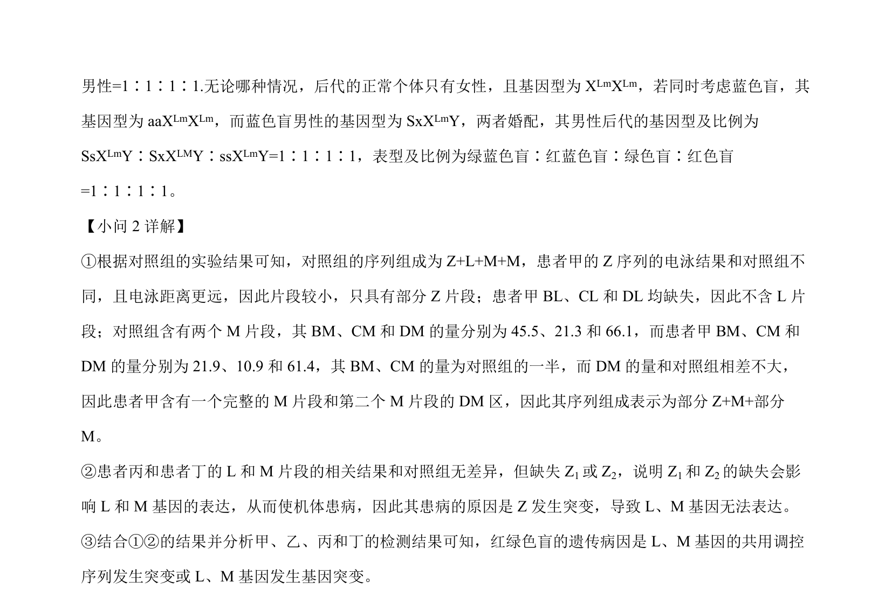

## 题面

## 摘要

考查伴性遗传的基因型推断和概率计算，以及血糖调节中胰岛素分泌与药物作用机制。

## 关联考点

- [[276-伴性遗传|伴性遗传]]
- [[301-基因突变|基因突变]]
- [[512-血糖调节|血糖调节]]
- [[胰岛素分泌]]

## 答案与解析

> 📄 原 PDF 第 14 页：`素材/真题/湖南/2008-2024·（湖南）生物高考真题/2024年高考生物试卷（湖南）（解析卷）.pdf`
