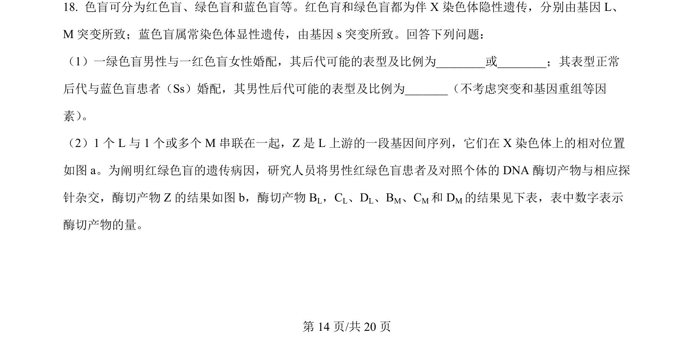
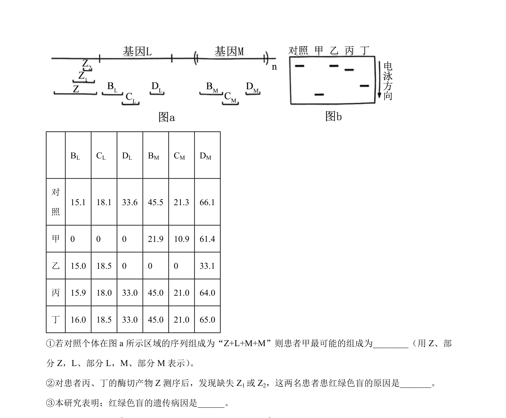
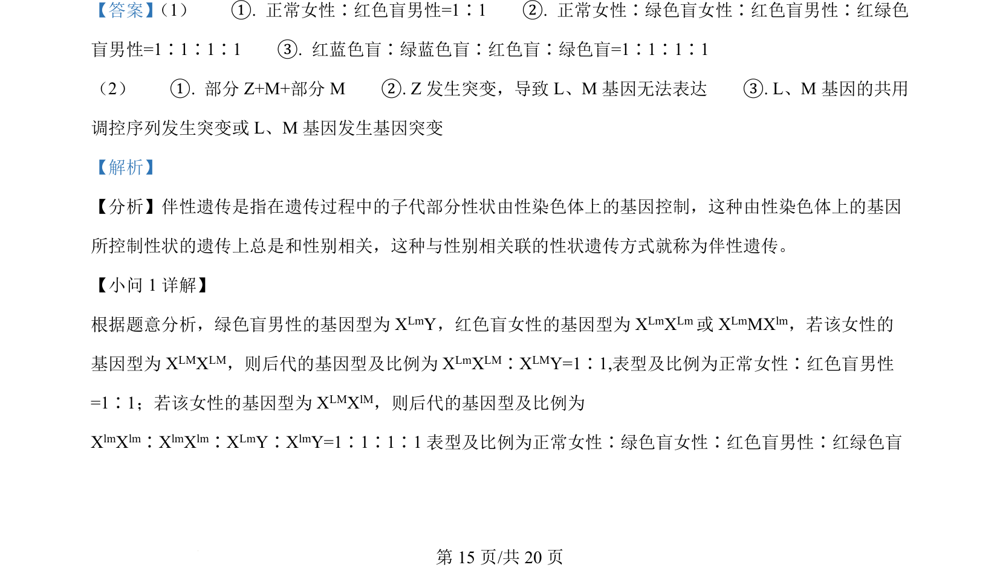
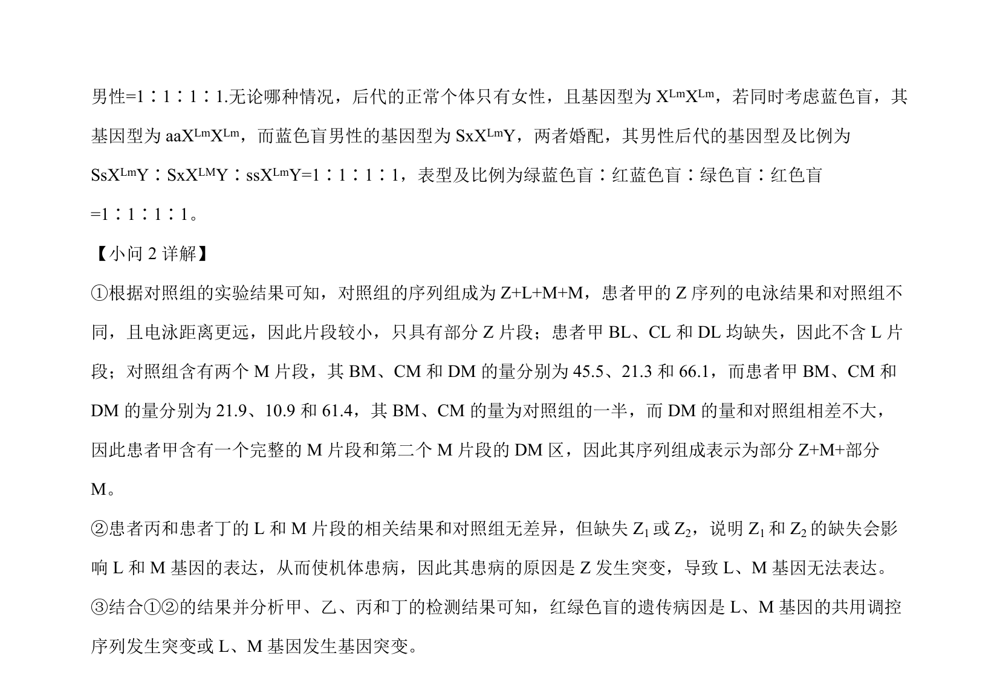

## 题面

## 摘要

考查伴性遗传的基因型推断和概率计算，以及血糖调节中胰岛素分泌与药物作用机制。

## 关联考点

- [[276-伴性遗传|伴性遗传]]
- [[301-基因突变|基因突变]]
- [[512-血糖调节|血糖调节]]
- [[胰岛素分泌]]

## 答案与解析

> 📄 原 PDF 第 14 页：`素材/真题/湖南/2008-2024·（湖南）生物高考真题/2024年高考生物试卷（湖南）（解析卷）.pdf`

<!-- 题干文本-start -->
## 题干文本
18. 色盲可分为红色盲、绿色盲和蓝色盲等。红色肓和绿色盲都为伴 X 染色体隐性遗传，分别由基因 L、
M 突变所致；蓝色盲属常染色体显性遗传，由基因 s 突变所致。回答下列问题：
（1）一绿色盲男性与一红色盲女性婚配，其后代可能的表型及比例为________或________；其表型正常
后代与蓝色盲患者（Ss）婚配，其男性后代可能的表型及比例为_______（不考虑突变和基因重组等因
素） 。
（2）1 个 L与 1 个或多个 M 串联在一起，Z是 L上游的一段基因间序列，它们在 X 染色体上的相对位置
如图 a。为阐明红绿色盲的遗传病因，研究人员将男性红绿色盲患者及对照个体的 DNA 酶切产物与相应探
针杂交，酶切产物 Z的结果如图 b，酶切产物 BL，CL、DL、BM、CM和 DM的结果见下表，表中数字表示
酶切产物的量。
<!-- 题干文本-end -->

<!-- 解析文本-start -->
## 解析文本

<!-- 解析文本-end -->
