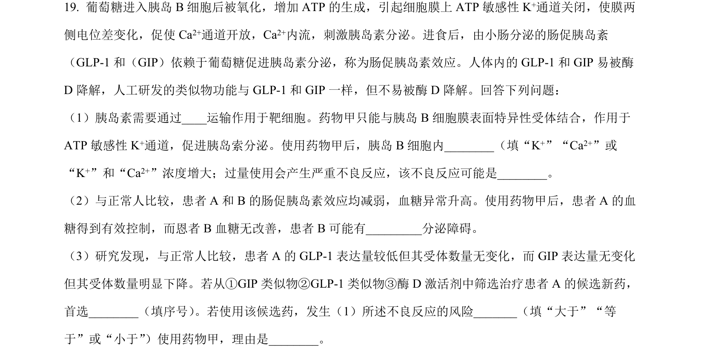
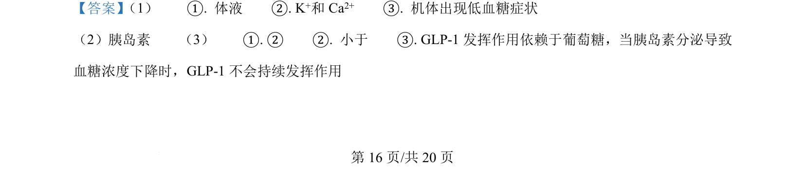
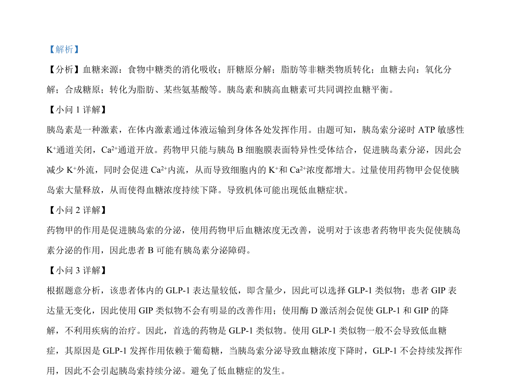

## 题面

## 摘要

考查血糖调节机制、胰岛素分泌及生态系统组成、物质循环与生态足迹。

## 关联考点

- [[872-血糖平衡调节|血糖平衡调节]]
- [[激素分泌调节]]
- [[生态系统组成成分]]
- [[383-生态系统物质循环|物质循环]]
- [[400-生态足迹|生态足迹]]

## 答案与解析

> 📄 原 PDF 第 16 页：`素材/真题/湖南/2008-2024·（湖南）生物高考真题/2024年高考生物试卷（湖南）（解析卷）.pdf`
