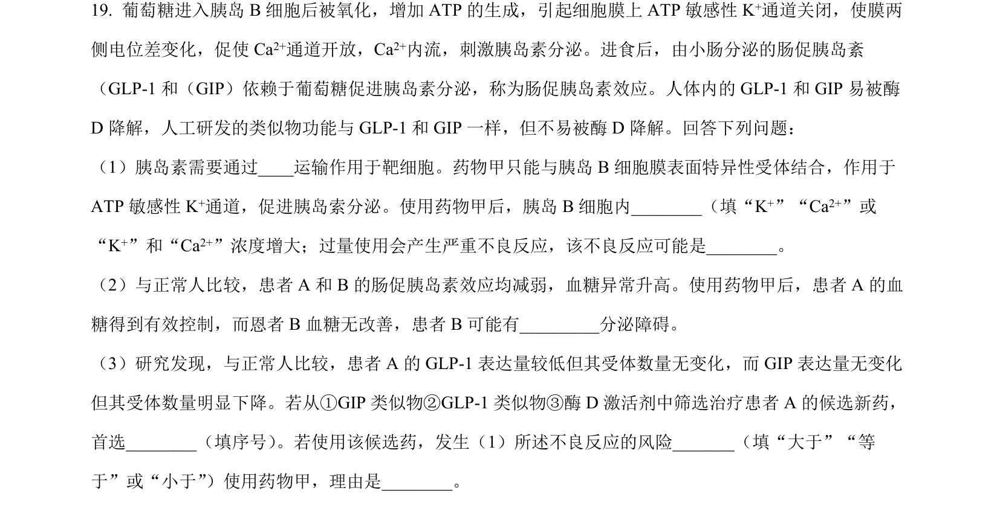
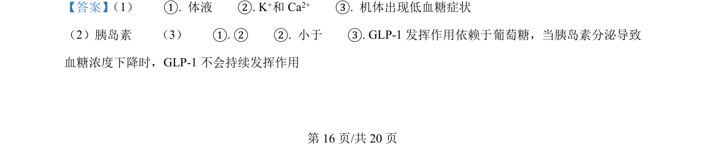
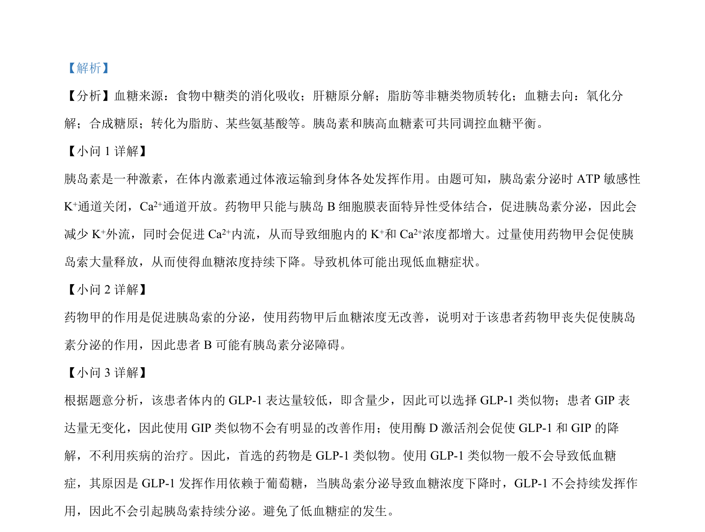

## 题面

## 摘要

考查血糖调节机制、胰岛素分泌及生态系统组成、物质循环与生态足迹。

## 关联考点

- [[872-血糖平衡调节|血糖平衡调节]]
- [[激素分泌调节]]
- [[生态系统组成成分]]
- [[383-生态系统物质循环|物质循环]]
- [[400-生态足迹|生态足迹]]

## 答案与解析

> 📄 原 PDF 第 16 页：`素材/真题/湖南/2008-2024·（湖南）生物高考真题/2024年高考生物试卷（湖南）（解析卷）.pdf`

<!-- 题干文本-start -->
## 题干文本
19. 葡萄糖进入胰岛 B细胞后被氧化，增加 ATP 的生成，引起细胞膜上 ATP 敏感性 K+通道关闭，使膜两
侧电位差变化，促使 Ca2+通道开放，Ca2+内流，刺激胰岛素分泌。进食后，由小肠分泌的肠促胰岛紊
（GLP-1 和（GIP）依赖于葡萄糖促进胰岛素分泌，称为肠促胰岛素效应。人体内的 GLP-1 和 GIP 易被酶
D 降解，人工研发的类似物功能与 GLP-1 和 GIP 一样，但不易被酶 D 降解。回答下列问题：
（1）胰岛素需要通过____运输作用于靶细胞。药物甲只能与胰岛 B细胞膜表面特异性受体结合，作用于
ATP 敏感性 K+通道，促进胰岛索分泌。使用药物甲后，胰岛 B细胞内________（填“K+”“Ca2+”或
“K+”和“Ca2+”浓度增大；过量使用会产生严重不良反应，该不良反应可能是________。
（2）与正常人比较，患者 A 和 B的肠促胰岛素效应均减弱，血糖异常升高。使用药物甲后，患者 A 的血
糖得到有效控制，而恩者 B血糖无改善，患者 B可能有_________分泌障碍。
（3）研究发现，与正常人比较，患者 A 的 GLP-1 表达量较低但其受体数量无变化，而 GIP 表达量无变化
但其受体数量明显下降。若从①GIP 类似物②GLP-1 类似物③酶 D 激活剂中筛选治疗患者 A 的候选新药，
首选________（填序号） 。若使用该候选药，发生（1）所述不良反应的风险_______（填“大于”“等
于”或“小于”）使用药物甲，理由是________。
<!-- 题干文本-end -->

<!-- 解析文本-start -->
## 解析文本
【答案】 （1）    ①. 体液    ②. K+和 Ca2+    ③. 机体出现低血糖症状    
（2）胰岛素    （3）    ①. ②    ②. 小于    ③. GLP-1 发挥作用依赖于葡萄糖，当胰岛素分泌导致
血糖浓度下降时，GLP-1 不会持续发挥作用
<!-- 解析文本-end -->
