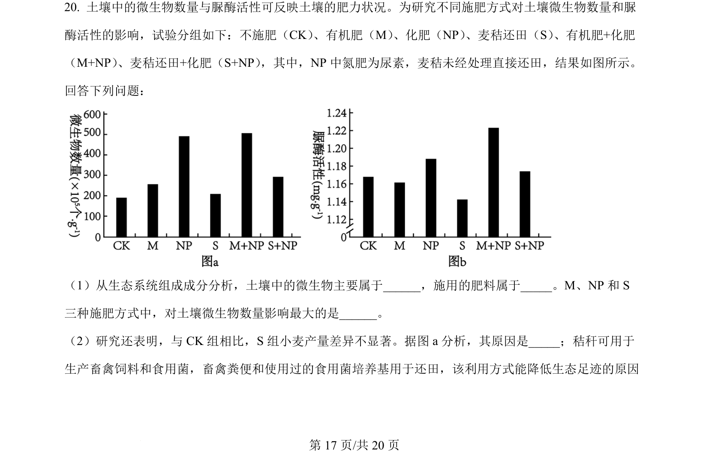
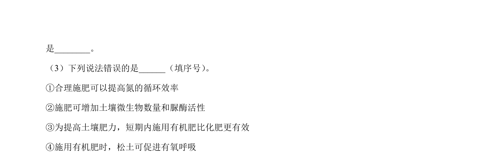
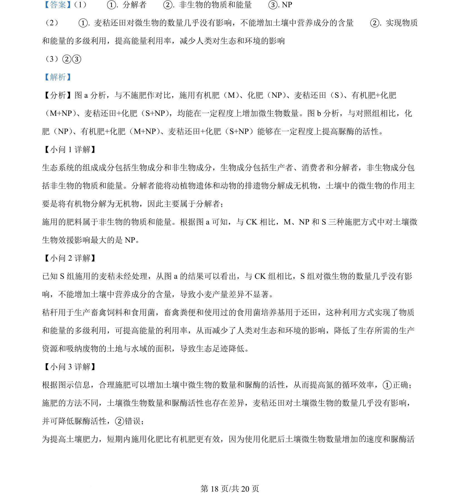
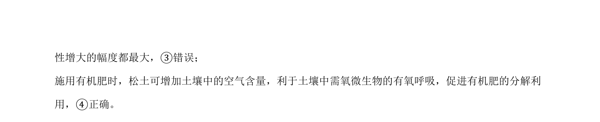

## 题面

## 摘要

考查农田施肥对土壤微生物数量与脲酶活性的影响，以及百合体细胞杂交、单倍体和基因工程育种技术。

## 关联考点

- [[384-生态系统的组成成分|生态系统的组成成分]]
- [[物质循环与能量流动]]
- [[846-影响酶活性的因素|影响酶活性的因素]]
- [[基因工程的操作步骤]]

## 答案与解析

> 📄 原 PDF 第 17 页：`素材/真题/湖南/2008-2024·（湖南）生物高考真题/2024年高考生物试卷（湖南）（解析卷）.pdf`
