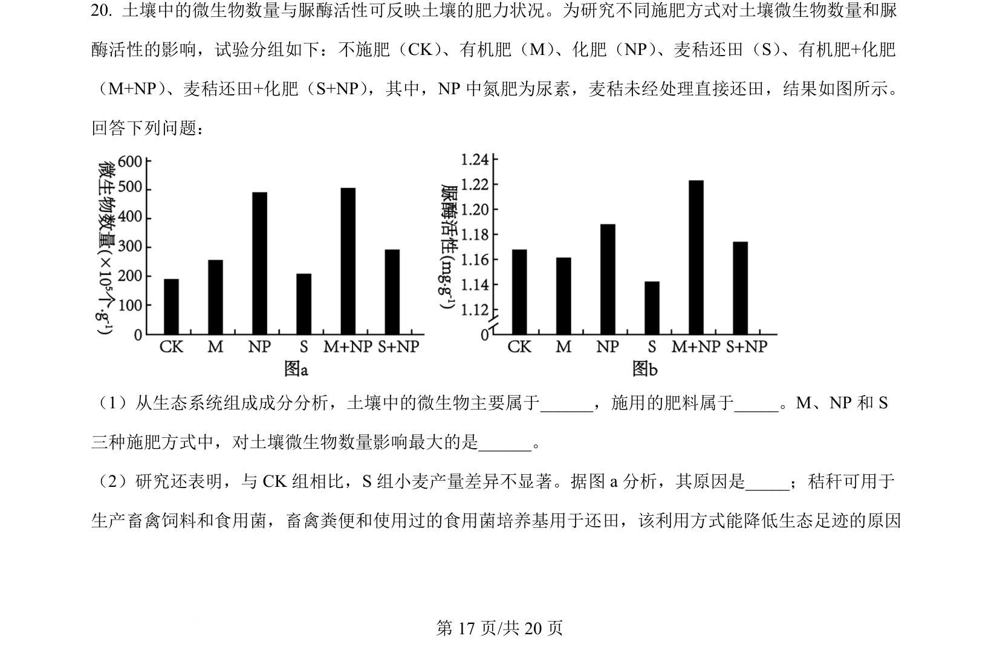
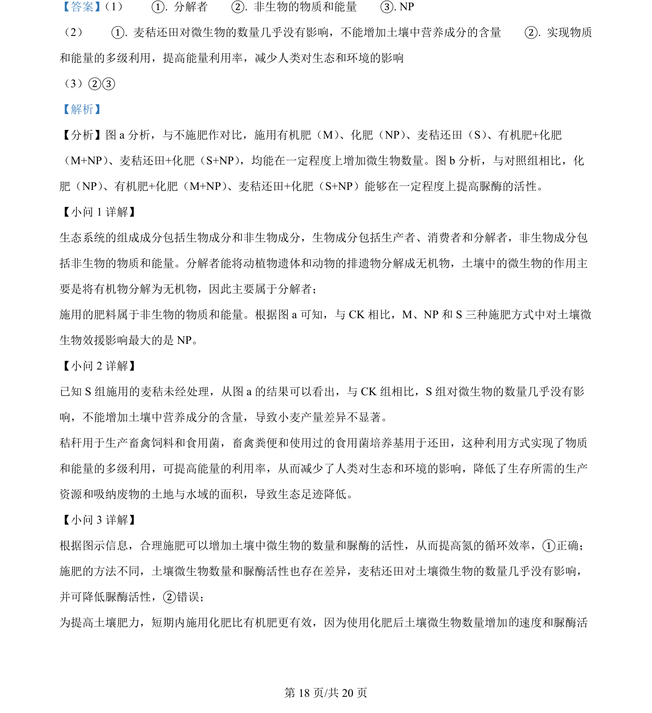

## 题面

## 摘要

考查农田施肥对土壤微生物数量与脲酶活性的影响，以及百合体细胞杂交、单倍体和基因工程育种技术。

## 关联考点

- [[384-生态系统的组成成分|生态系统的组成成分]]
- [[物质循环与能量流动]]
- [[846-影响酶活性的因素|影响酶活性的因素]]
- [[基因工程的操作步骤]]

## 答案与解析

> 📄 原 PDF 第 17 页：`素材/真题/湖南/2008-2024·（湖南）生物高考真题/2024年高考生物试卷（湖南）（解析卷）.pdf`

<!-- 题干文本-start -->
## 题干文本
20. 土壤中的微生物数量与脲酶活性可反映土壤的肥力状况。为研究不同施肥方式对土壤微生物数量和脲
酶活性的影响，试验分组如下：不施肥（CK） 、有机肥（M） 、化肥（NP） 、麦秸还田（S） 、有机肥+化肥
（M+NP） 、麦秸还田+化肥（S+NP） ，其中，NP 中氮肥为尿素，麦秸未经处理直接还田，结果如图所示。
回答下列问题：
  
（1）从生态系统组成成分分析，土壤中的微生物主要属于______，施用的肥料属于_____。M、NP 和 S
三种施肥方式中，对土壤微生物数量影响最大的是______。
（2）研究还表明，与 CK 组相比，S 组小麦产量差异不显著。据图 a分析，其原因是_____；秸秆可用于
生产畜禽饲料和食用菌，畜禽粪便和使用过的食用菌培养基用于还田，该利用方式能降低生态足迹的原因
<!-- 题干文本-end -->

<!-- 解析文本-start -->
## 解析文本

<!-- 解析文本-end -->
