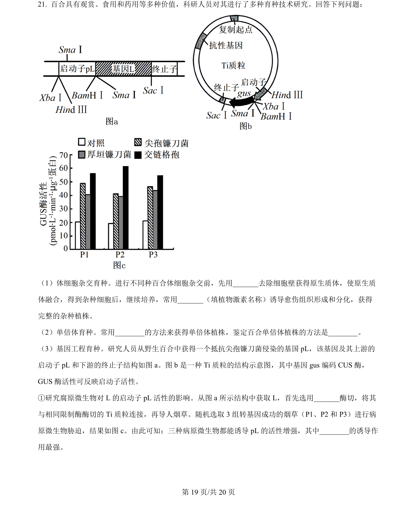
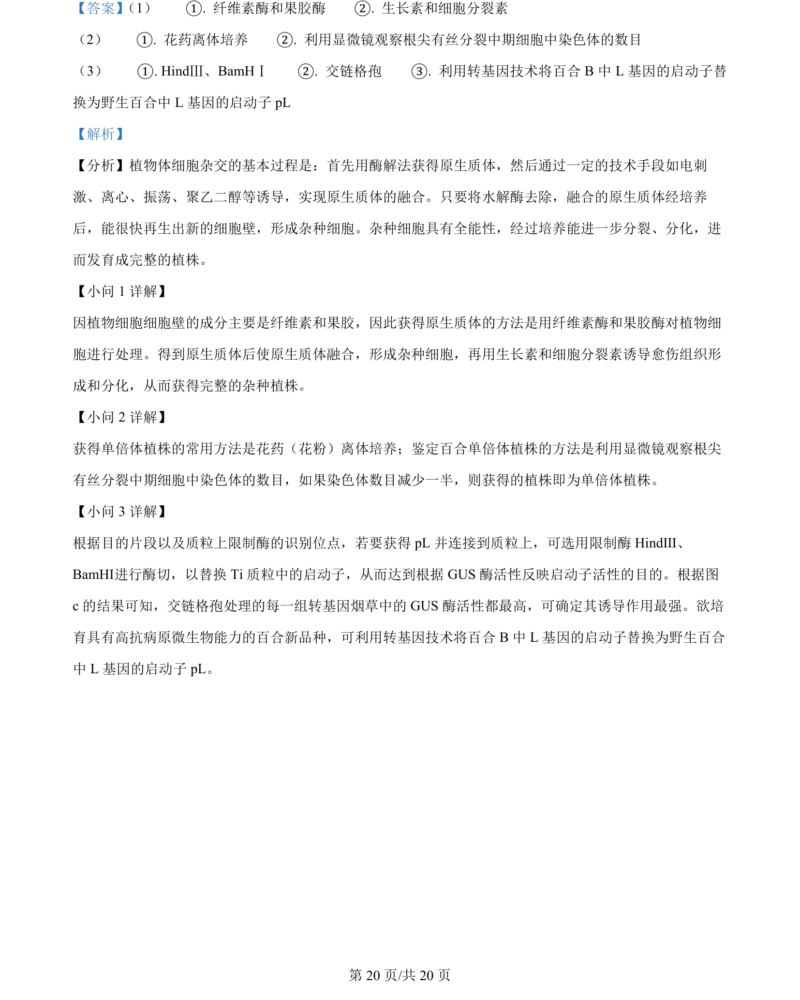

## 题面

## 摘要

本题综合考查植物体细胞杂交、单倍体育种和转基因技术中启动子替换等操作。

## 关联考点

- [[436-植物体细胞杂交|植物体细胞杂交]]
- [[300-单倍体|单倍体育种]]
- [[411-基因工程|基因工程]]
- [[限制酶识别序列]]

## 答案与解析

> 📄 原 PDF 第 19 页：`素材/真题/湖南/2008-2024·（湖南）生物高考真题/2024年高考生物试卷（湖南）（解析卷）.pdf`
