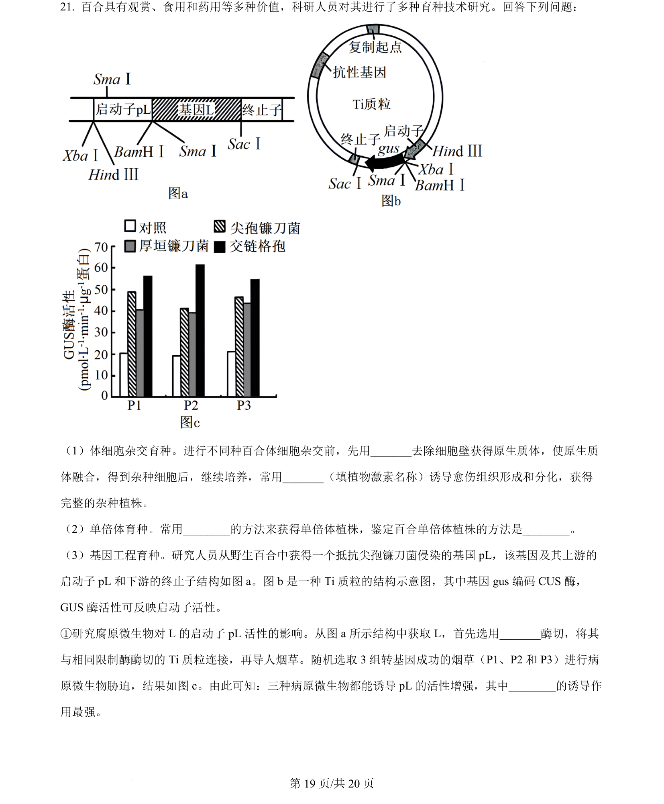
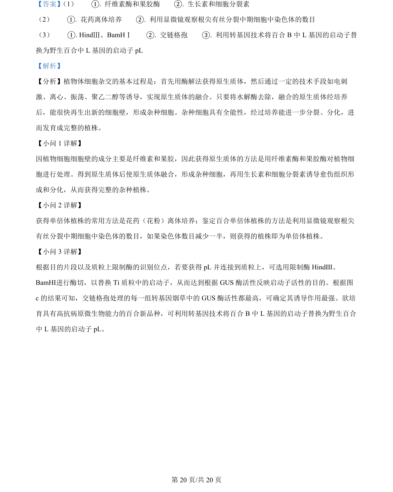

## 题面

## 摘要

本题综合考查植物体细胞杂交、单倍体育种和转基因技术中启动子替换等操作。

## 关联考点

- [[436-植物体细胞杂交|植物体细胞杂交]]
- [[300-单倍体|单倍体育种]]
- [[411-基因工程|基因工程]]
- [[限制酶识别序列]]

## 答案与解析

> 📄 原 PDF 第 19 页：`素材/真题/湖南/2008-2024·（湖南）生物高考真题/2024年高考生物试卷（湖南）（解析卷）.pdf`

<!-- 题干文本-start -->
## 题干文本
21. 百合具有观赏、食用和药用等多种价值，科研人员对其进行了多种育种技术研究。回答下列问题：
（1）体细胞杂交育种。进行不同种百合体细胞杂交前，先用_______去除细胞壁获得原生质体，使原生质
体融合，得到杂种细胞后，继续培养，常用_______（填植物激素名称）诱导愈伤组织形成和分化，获得
完整的杂种植株。
（2）单倍体育种。常用________的方法来获得单倍体植株，鉴定百合单倍体植株的方法是________。
（3）基因工程育种。研究人员从野生百合中获得一个抵抗尖孢镰刀菌侵染的基国 pL，该基因及其上游的
启动子 pL和下游的终止子结构如图 a。图 b 是一种 Ti质粒的结构示意图，其中基因 gus 编码 CUS 酶，
GUS 酶活性可反映启动子活性。
①研究腐原微生物对 L的启动子 pL活性的影响。从图 a所示结构中获取 L，首先选用_______酶切，将其
与相同限制酶酶切的 Ti质粒连接，再导人烟草。随机选取 3 组转基因成功的烟草（P1、P2 和 P3）进行病
原微生物胁迫，结果如图 c。由此可知：三种病原微生物都能诱导 pL的活性增强，其中________的诱导作
用最强。
<!-- 题干文本-end -->

<!-- 解析文本-start -->
## 解析文本

<!-- 解析文本-end -->
