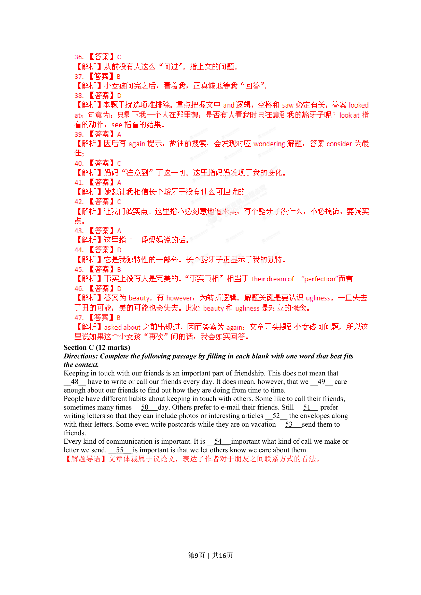
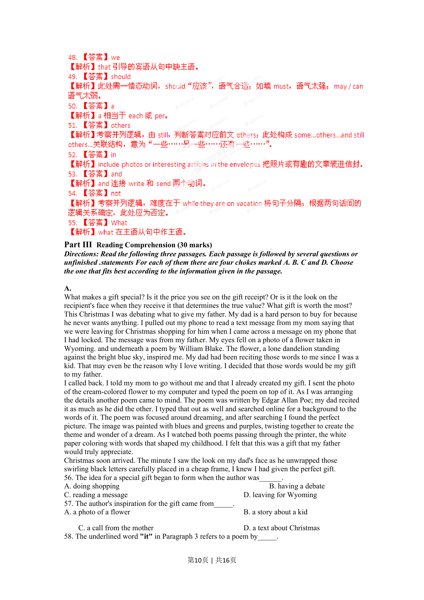
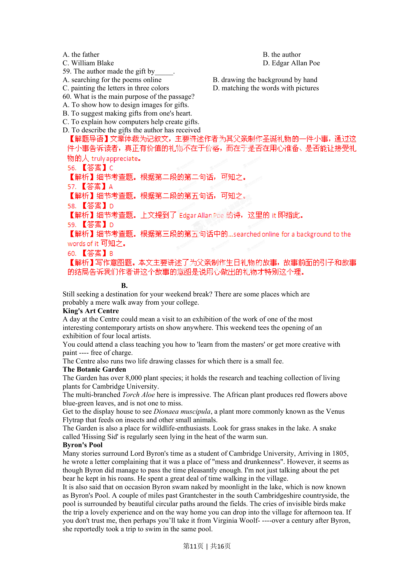
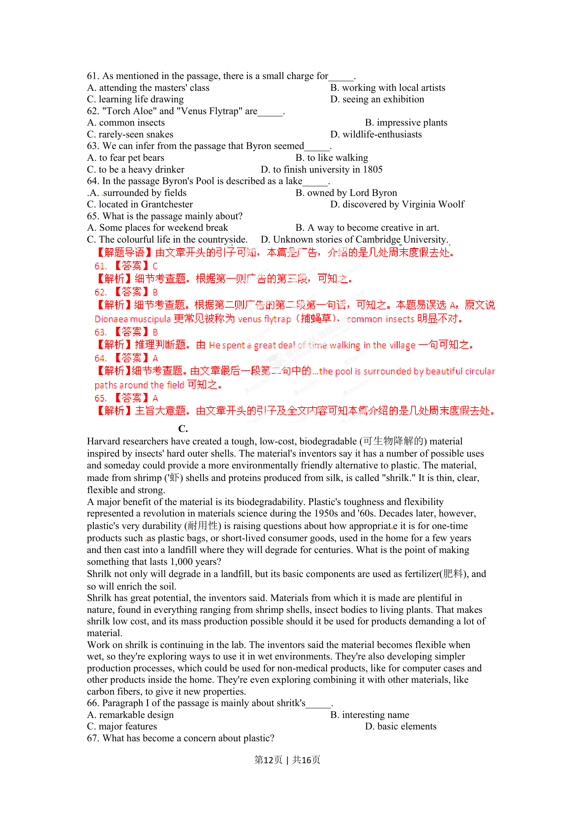
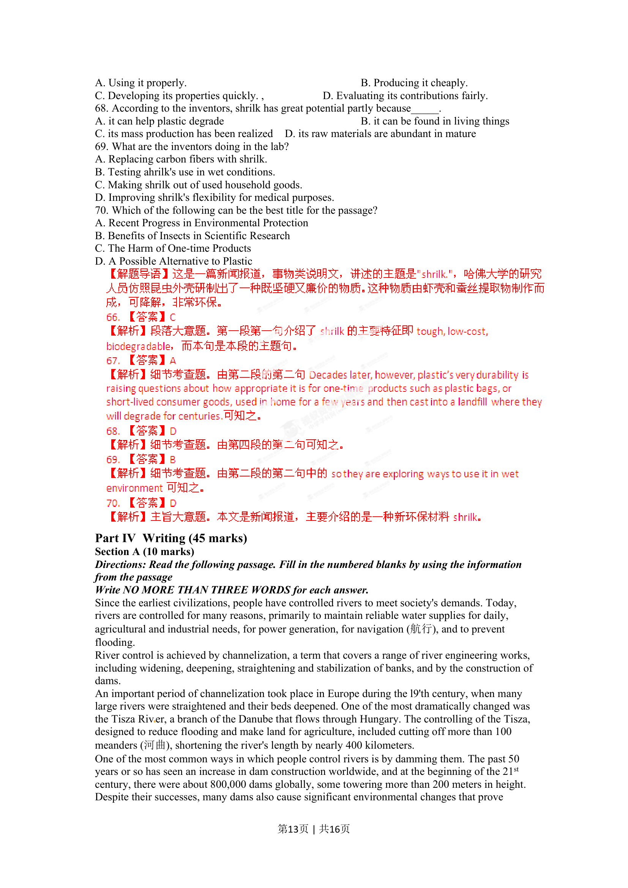
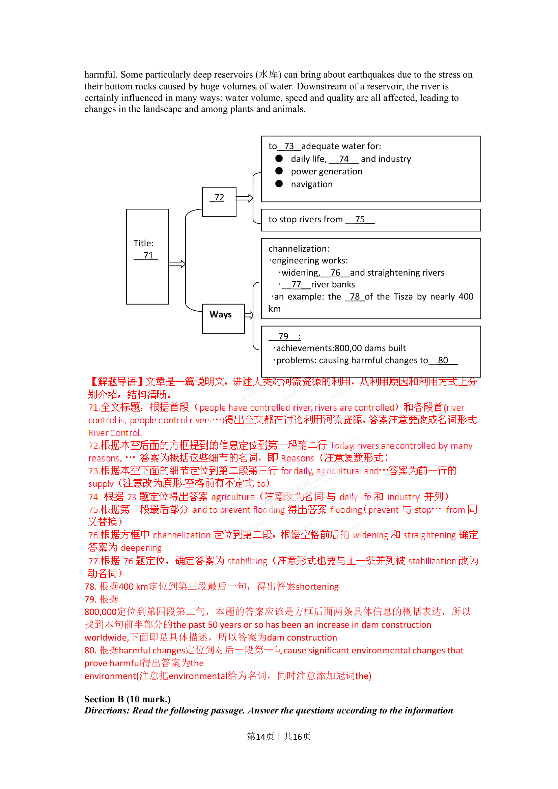
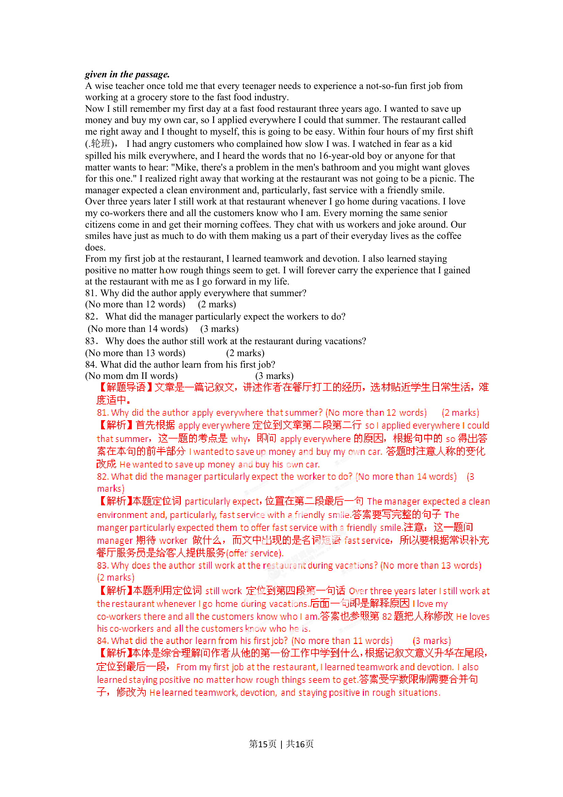
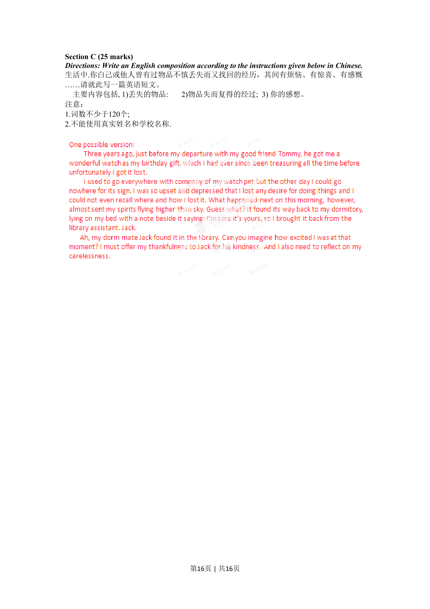

## 篇章题面

## 摘要

本题考查主谓一致。句意：所有的科学证据表明在农业中越来越多地使用化学物 质正在危害我们的健康。evidence是不可数名词，所以主句的谓语动词为shows；而在宾语 从句中主语部分increasing use of chemicals in farming的中心词为use，所以谓语动词为is。 Part Ⅱ Section B (18 marks) Directions: For each bla

## 关联考点

- [[996-书面表达|书面表达]]
- [[1007-应用文写作|应用文写作]]

## 答案

`D`

## 解析

> 📄 原 PDF 第 7 页：`素材/真题/湖南/2008-2024·（湖南）英语高考真题/2012年高考英语试卷（湖南）（解析卷）.pdf`
