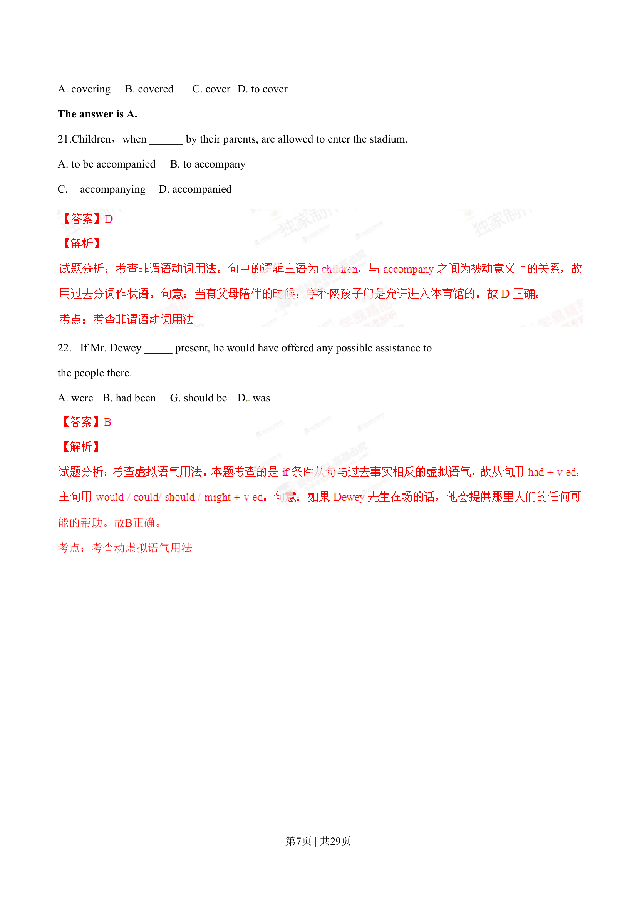
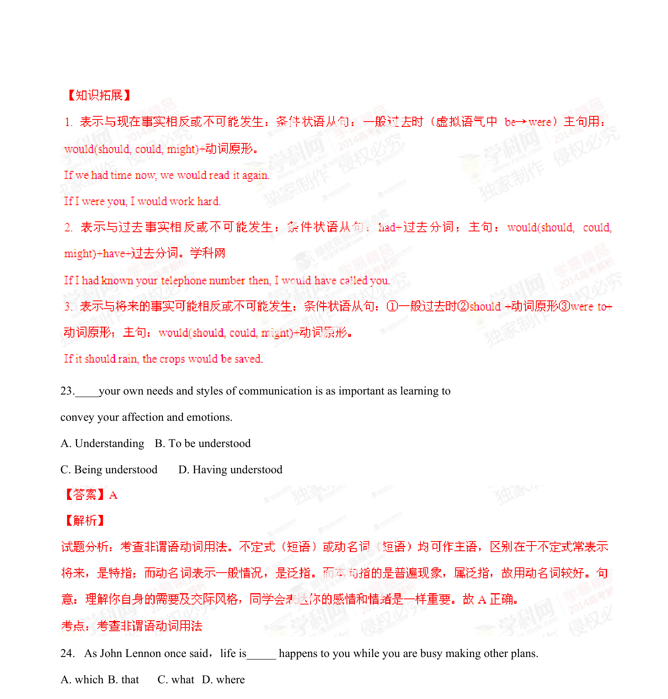

## 篇章题面

## 摘要

试题分析：考查名词性从句用法。本题主句是一个表语从句，表语从句中缺少主语，故用what来引导。在 名词性从句中，当从句缺少主语、宾语或表语时，一般用关系词what来引导。句意：正如约翰·列侬曾经说 过，当我们正在为生活疲于奔波时,生活已离我们远去。故C正确。 考点：考查名词性从句用法 25. — I’ve prepared all kinds of food for the picnic. —Do

## 关联考点

- [[996-书面表达|书面表达]]
- [[1007-应用文写作|应用文写作]]

## 答案

`C`

## 解析

> 📄 原 PDF 第 8 页：`素材/真题/湖南/2008-2024·（湖南）英语高考真题/2014年高考英语试卷（湖南）（解析卷）.pdf`
