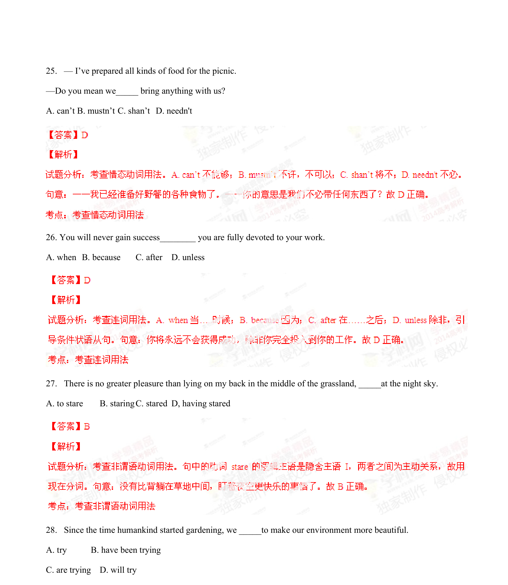
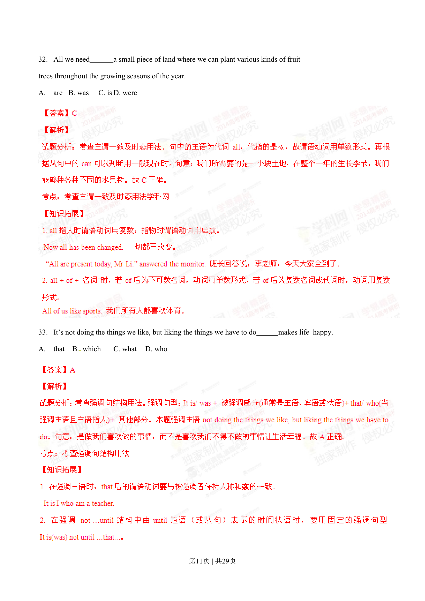

## 篇章题面

## 摘要

[来源:学。科。网] 29. Only when you can find peace in your heart _____good relationships with others. A. will you keep B. you will keep C. you kept D. did you keep 30.______ what you’re doing today important

## 关联考点

- [[996-书面表达|书面表达]]
- [[1007-应用文写作|应用文写作]]

## 答案

`B`

## 解析

> 📄 原 PDF 第 9 页：`素材/真题/湖南/2008-2024·（湖南）英语高考真题/2014年高考英语试卷（湖南）（解析卷）.pdf`
