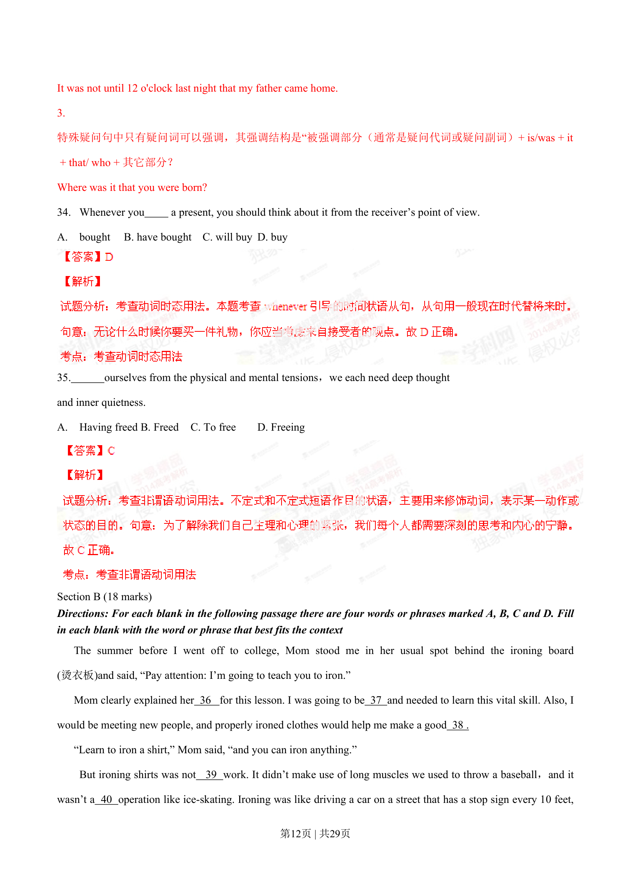
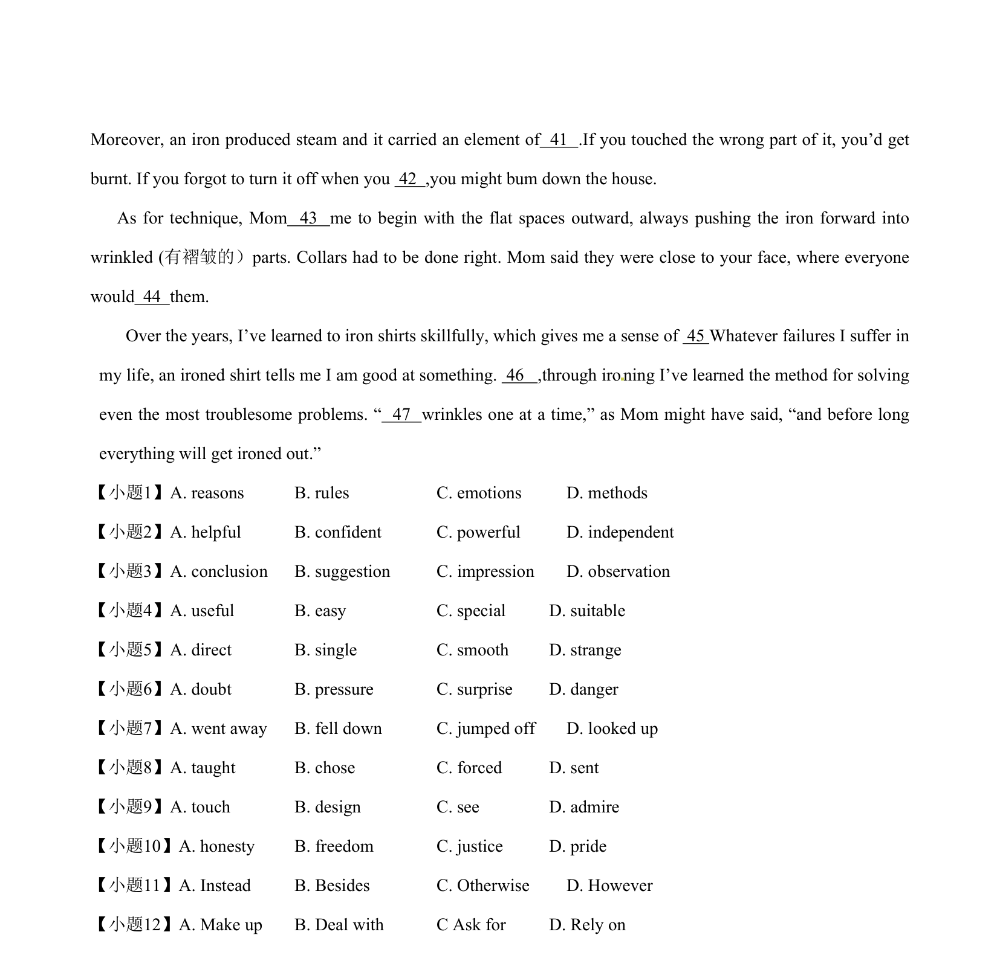
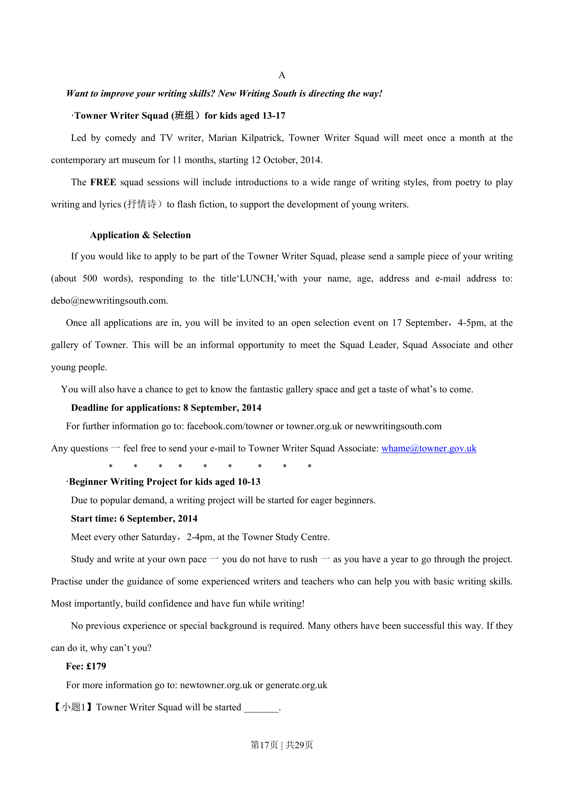
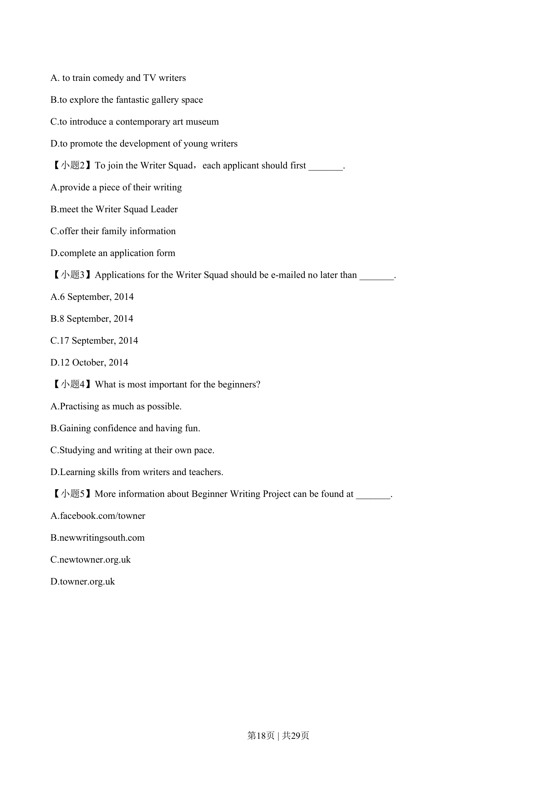
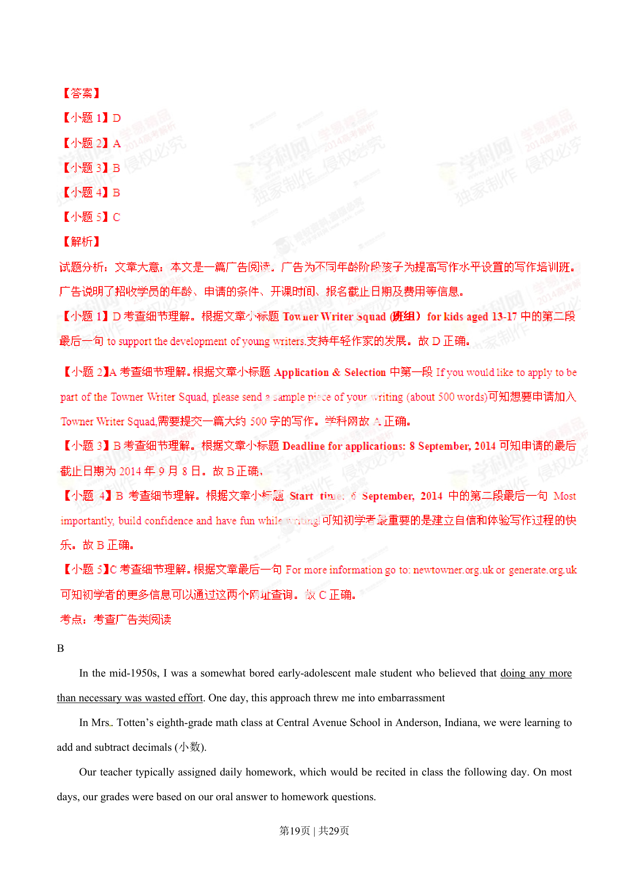
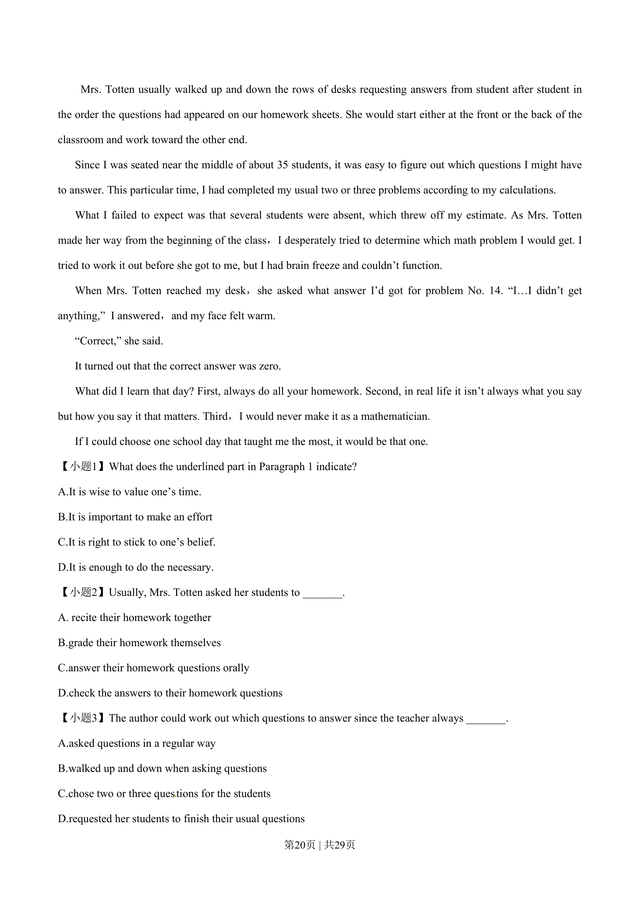
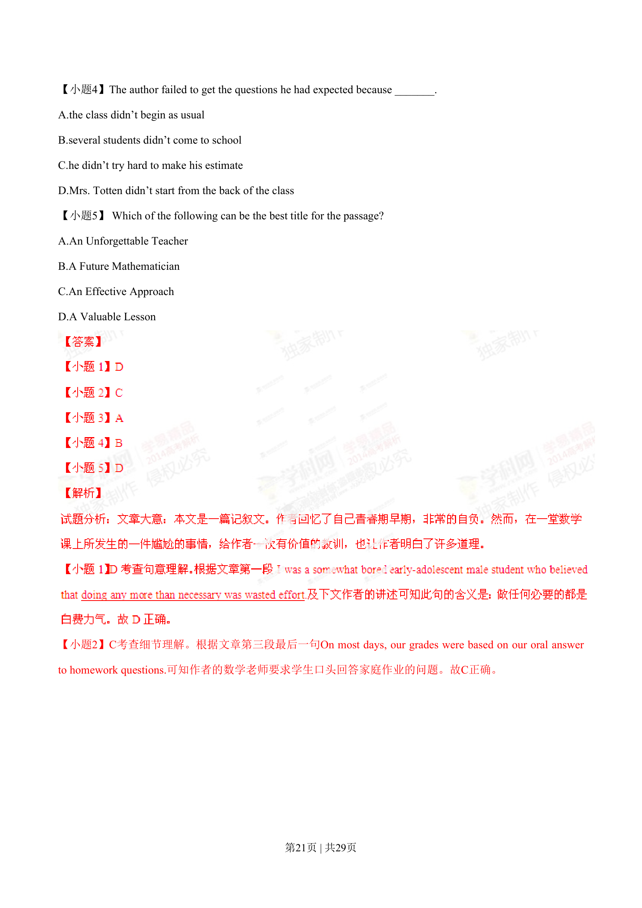
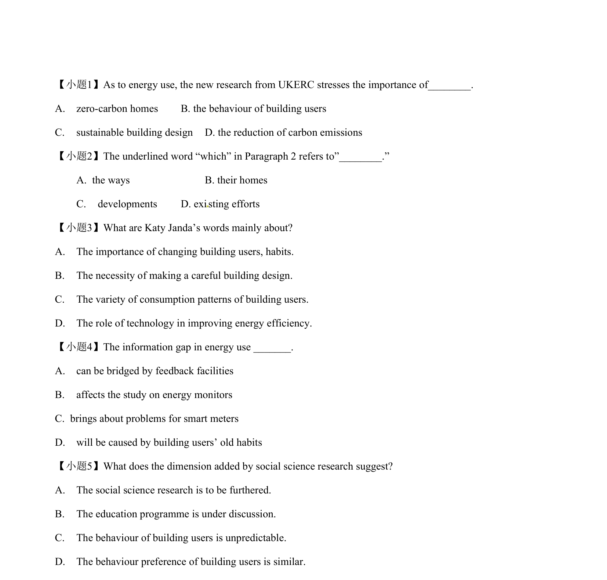

## 篇章题面

## 摘要

（待补）

## 关联考点

- [[1031-语篇填空|语篇填空]]
- [[1018-语法填空|语法填空]]

## 答案

`【小题1】A 【小题2】D 【小题3】C 【小题4】B 【小题5】C 【小题6】D 【小题7】A 【小题8】A 【小题9】C 【小题12】考查动词短语辨析及语境理解。A. Make up组成、编造；B. Deal with处理。对付；C Ask for询问；D. Rely on依靠。 “一次处理皱的部分”，正如妈妈曾经说过，“不久之后一切都会解决”。故选B 考点：考查记叙文 Section C (12 marks) Directions: Complete the following passage by filling in each blank with one word that bes`

## 解析

> 📄 原 PDF 第 13 页：`素材/真题/湖南/2008-2024·（湖南）英语高考真题/2014年高考英语试卷（湖南）（解析卷）.pdf`
