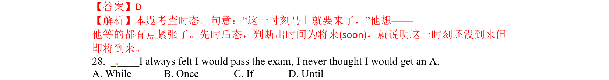
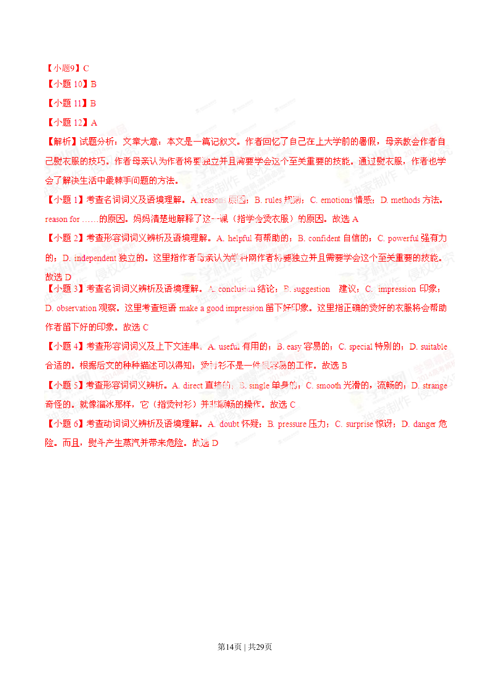
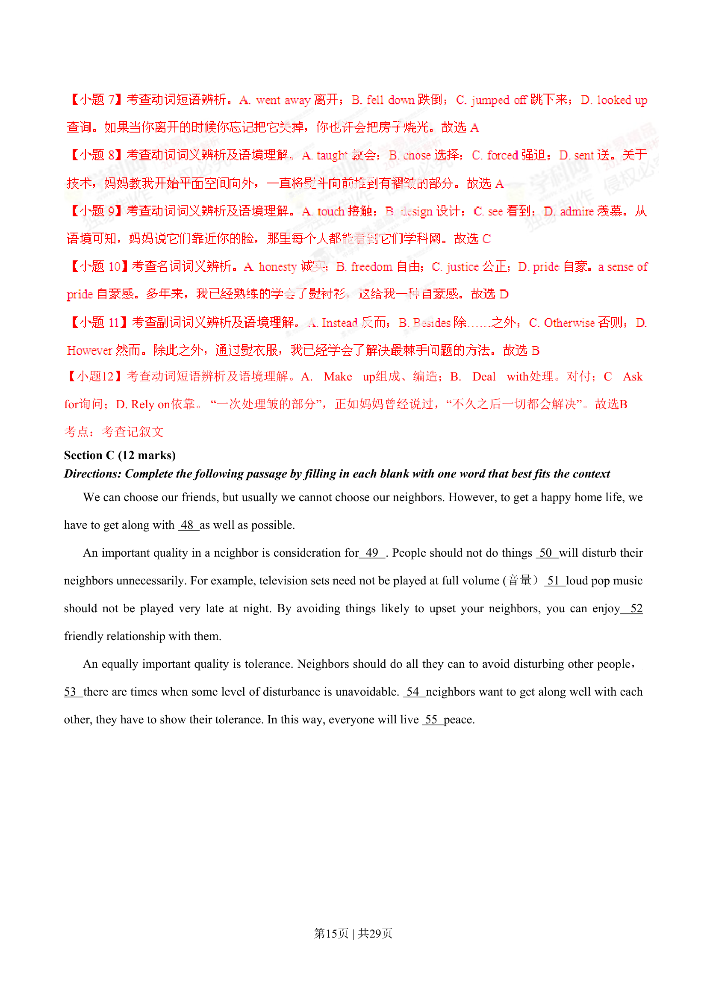
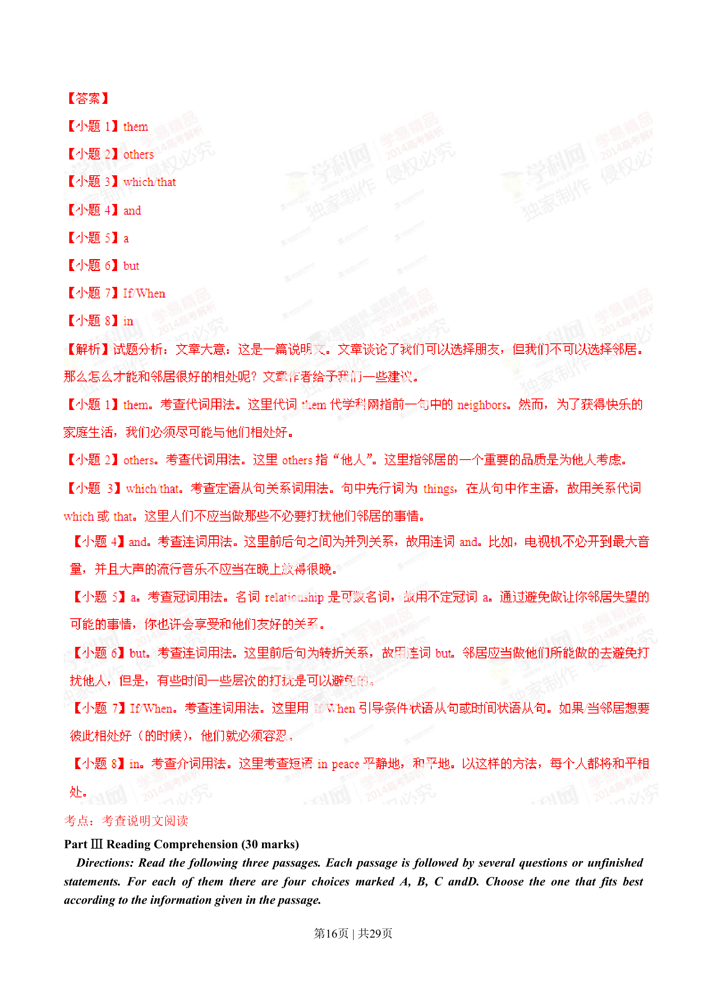
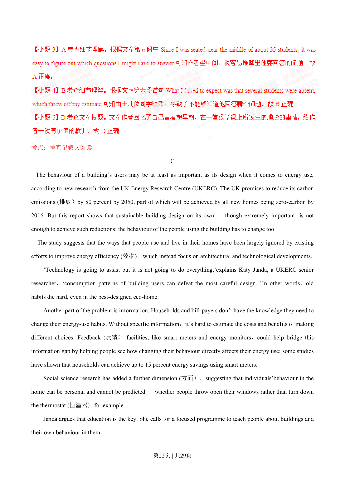
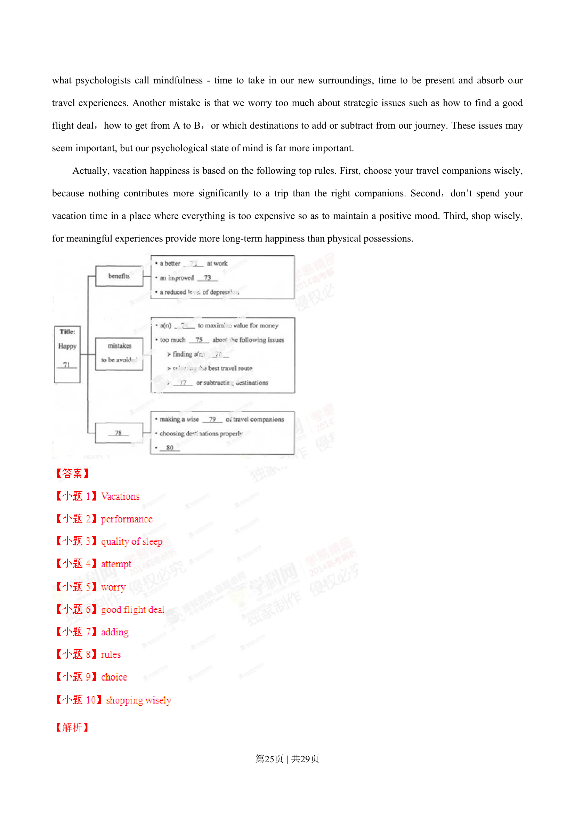
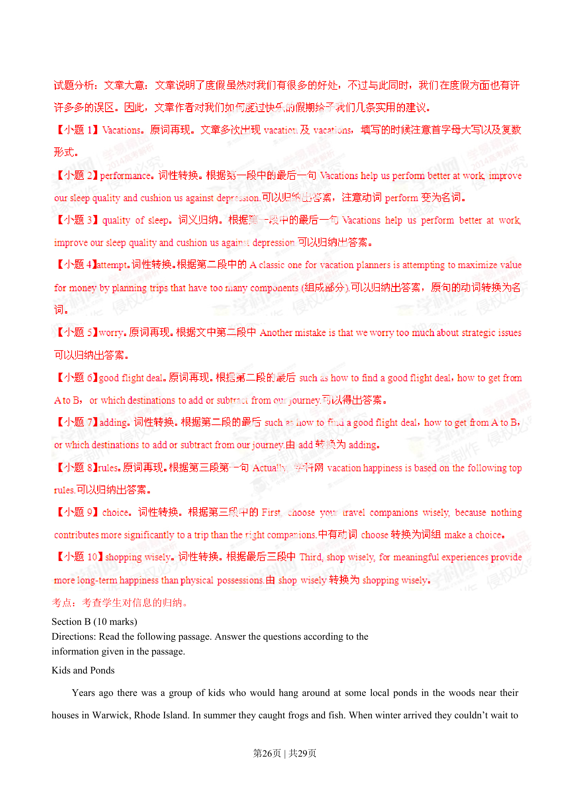

## 篇章题面

## 摘要

考点：考查科普环保类阅读 Part IV Writing (45 marks) Section A (10 marks) Directions: Read the following passage. Fill in the numbered blanks by using the information from the passage. Write NO MORE THAN THREE WOR

## 关联考点

- [[996-书面表达|书面表达]]
- [[1007-应用文写作|应用文写作]]

## 答案

`【小题1】B 【小题2】D 【小题3】A 【小题4】A 【小题5】C`

## 解析

> 📄 原 PDF 第 23 页：`素材/真题/湖南/2008-2024·（湖南）英语高考真题/2014年高考英语试卷（湖南）（解析卷）.pdf`
