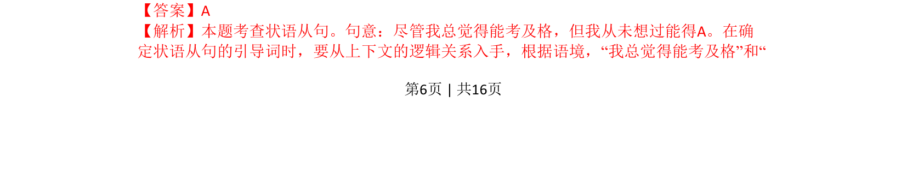
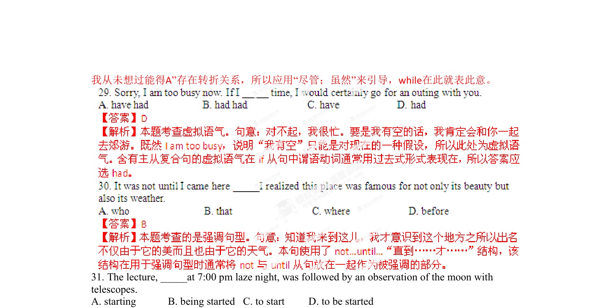
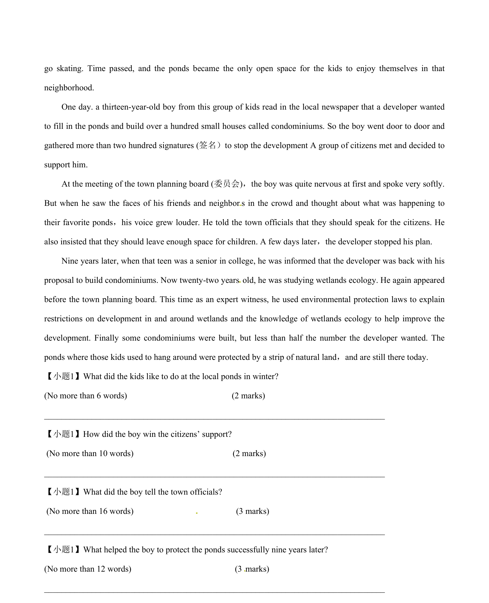
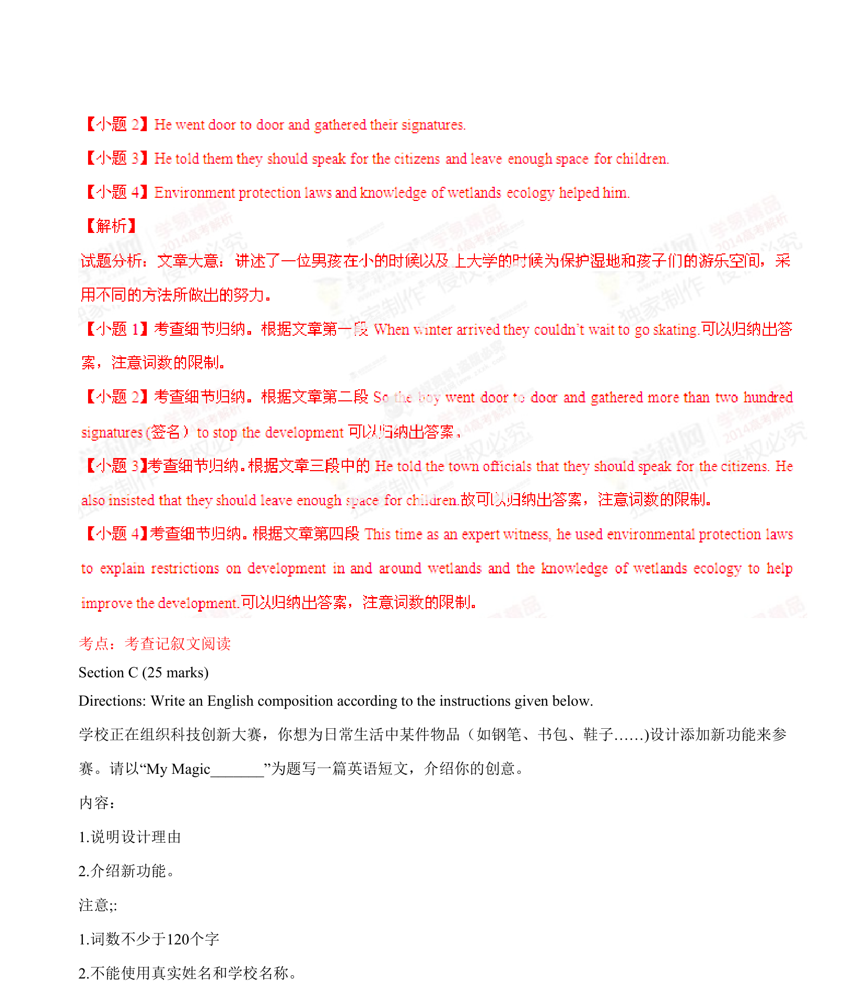

## 篇章题面

## 摘要

（待补）

## 关联考点

- [[1031-语篇填空|语篇填空]]
- [[1018-语法填空|语法填空]]

## 答案

`【小题1】They liked to go skating. 考点：考查记叙文阅读 Section C (25 marks) Directions: Write an English composition according to the instructions given below. 学校正在组织科技创新大赛，你想为日常生活中某件物品（如钢笔、书包、鞋子……)设计添加新功能来参 赛。请以“My Magic_______”为题写一篇英语短文，介绍你的创意。 内容： 1.说明设计理由 2.介绍新功能。 注意;: 1.词数不少于120个字 2.不能使用真实姓名和学校名称。`

## 解析

> 📄 原 PDF 第 27 页：`素材/真题/湖南/2008-2024·（湖南）英语高考真题/2014年高考英语试卷（湖南）（解析卷）.pdf`
