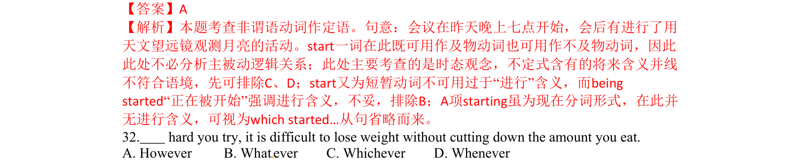
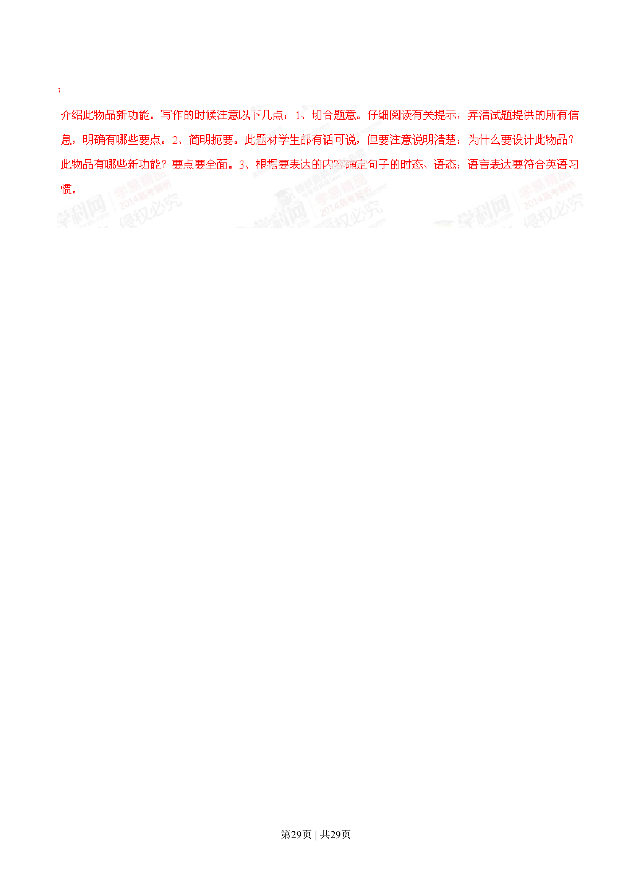

## 篇章题面

## 摘要

试题分析：本书面表达是一篇说明文。所给出的题材十分贴近学生生活，学生能够从日常生活中的熟悉的 物品适当发挥想象。本书面表达的要求写一篇说明文，所给的要点也很清楚：说明学生所选物品设计理由 ；

## 关联考点

- [[996-书面表达|书面表达]]
- [[1007-应用文写作|应用文写作]]

## 答案

`略`

## 解析

> 📄 原 PDF 第 28 页：`素材/真题/湖南/2008-2024·（湖南）英语高考真题/2014年高考英语试卷（湖南）（解析卷）.pdf`
