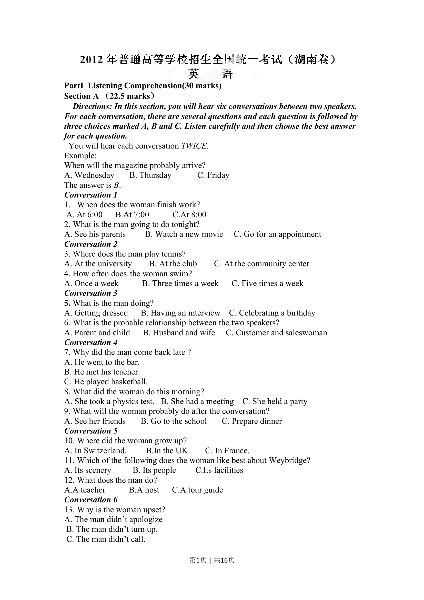
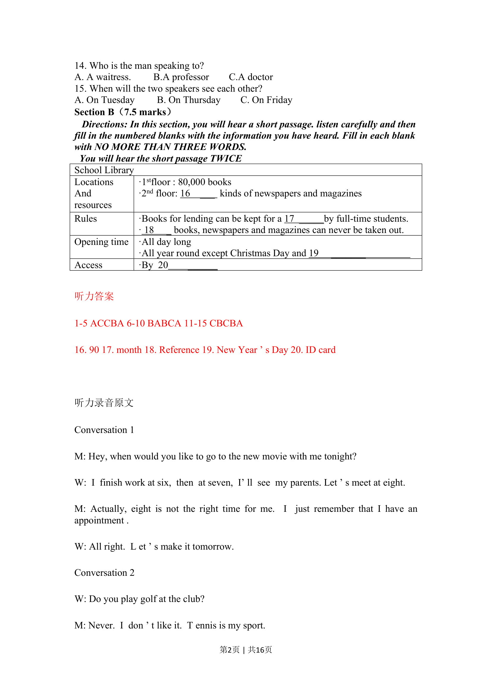
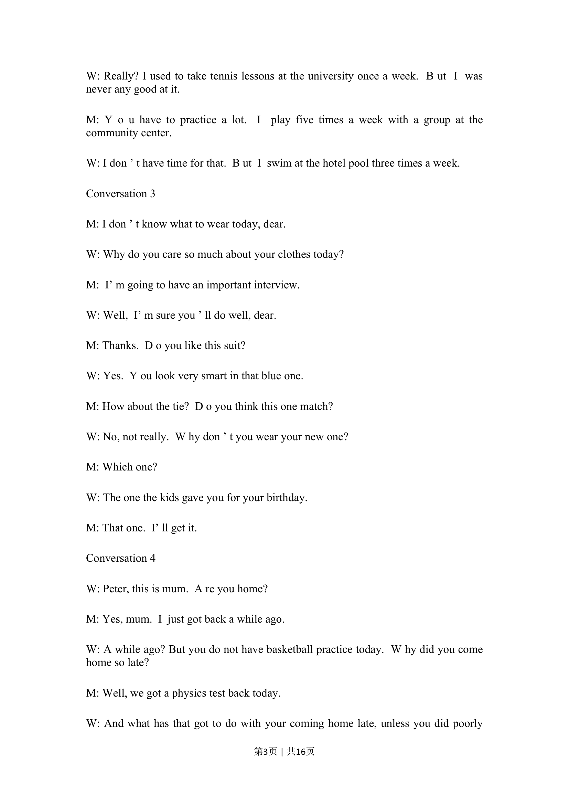
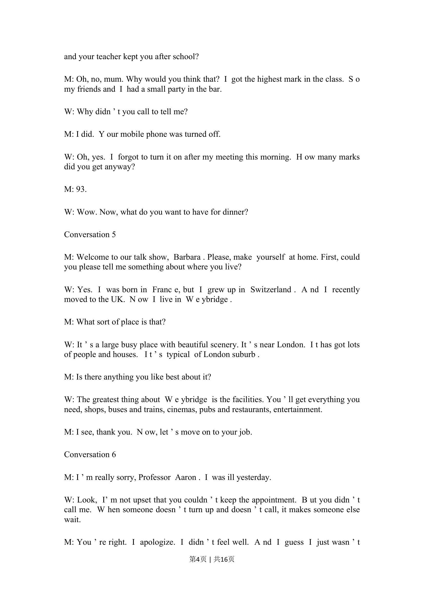
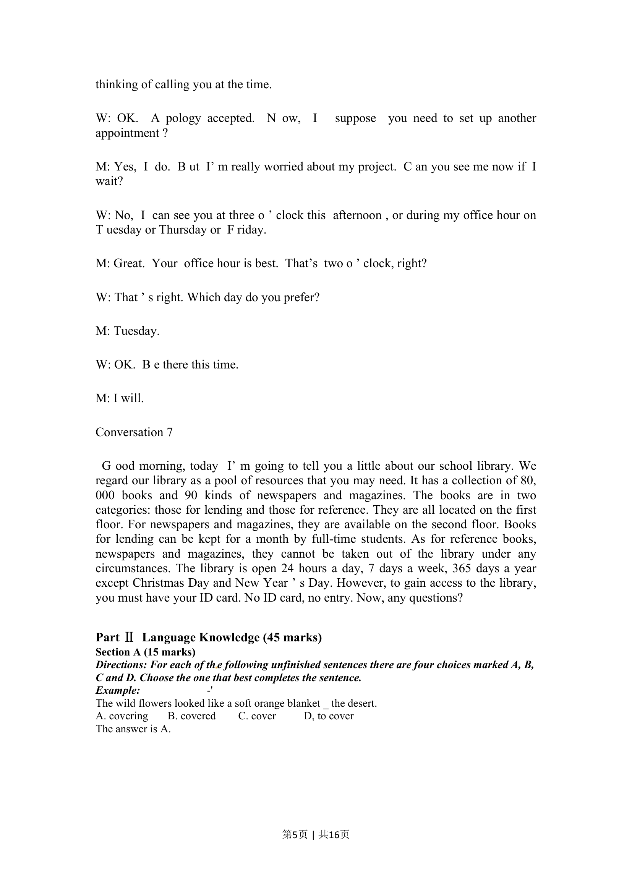
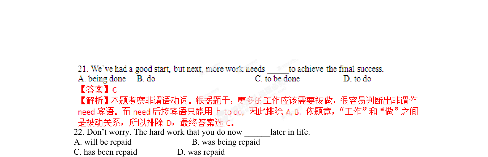

## 篇章题面

## 摘要

（待补）

## 关联考点

- [[1031-语篇填空|语篇填空]]
- [[1018-语法填空|语法填空]]

## 答案

`B 【考点定位】考查强调句。 【名师点睛】本题旨在考查强调句，要求有学生掌握好强调句的常用句型以及相关知识的能力。强调是有 效地进行思想交流的重要手段之一。人们在交际过程中，为了使自己的思想能被对方恰当的理解，必须加 强语气，突出重要的内容，增加对比效果与感情色彩，这时就会用到强调。分析句子时首先要看清楚结构 ，It was/is…开头而后面跟句子时就要看它是不是强调句了。强调句有一个特点：拿掉It was/is…that…后不影响整个句子的完整性，则是强调句。判断完是不是强调句后再根据强调的部分是人还 是物来选择连接词that或者是who。 22.As you go through this`

## 解析

> 📄 原 PDF 第 6 页：`素材/真题/湖南/2008-2024·（湖南）英语高考真题/2015年高考英语试卷（湖南）（解析卷）.pdf`
