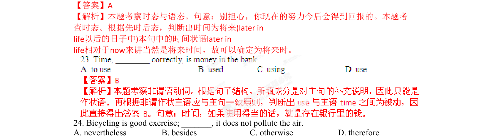
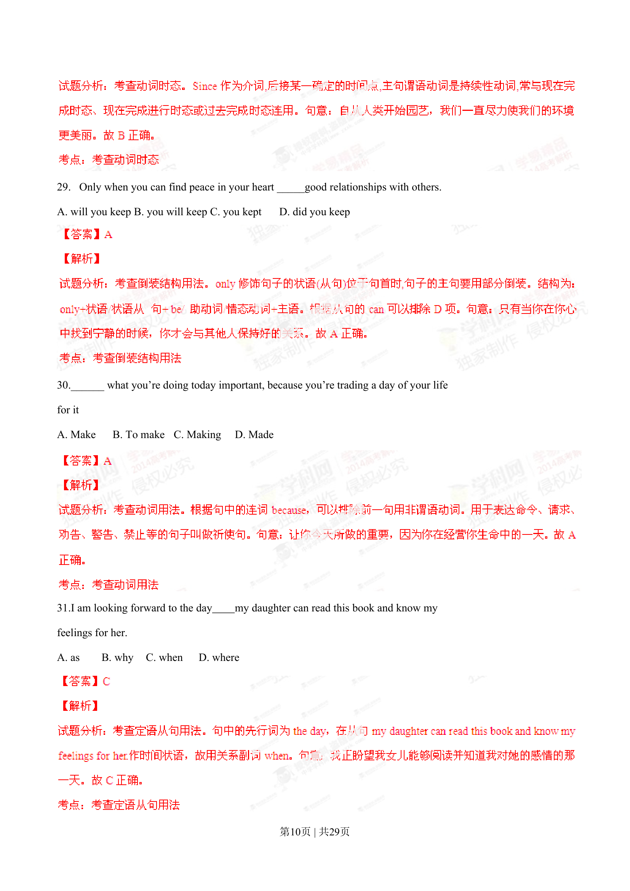

## 篇章题面

## 摘要

（待补）

## 关联考点

- [[1031-语篇填空|语篇填空]]
- [[1018-语法填空|语法填空]]

## 答案

`A 【考点定位】考查时态。 【名师点睛】本题旨在考查句子的时态，要求学生明确地掌握各个时态的定义以及它们在时间上的划分段 和用法。“助动词will或shall+动词原形”这一形式，表示将来发生的事情，用于征求对方的意见或表示客气 的邀请。现在完成时表示到说话时为止（或到现在为止）已经发生或完成了（不一定结束）的动作或状态 ，共有四种主要用法：一、现在完成时表示影响；二、现在完成时表示持续；三、现在完成时表示重复； 四、现在完成时表示将来。而在此题中As you go through this book是一个现在时了，所以后文就不能出现过去时或过去完成时。虽然在此题中没有明确的时间状语，但 从意`

## 解析

> 📄 原 PDF 第 6 页：`素材/真题/湖南/2008-2024·（湖南）英语高考真题/2015年高考英语试卷（湖南）（解析卷）.pdf`
