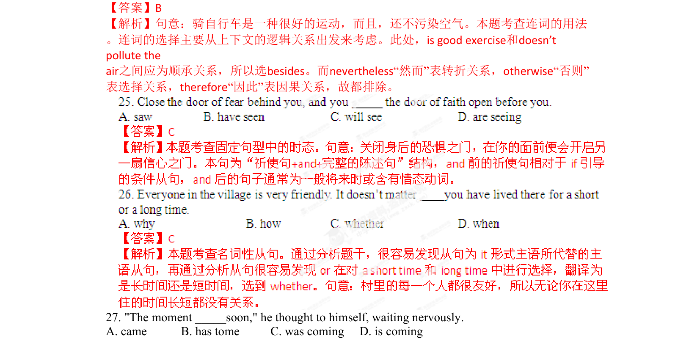

## 篇章题面

## 摘要

（待补）

## 关联考点

- [[1031-语篇填空|语篇填空]]
- [[1018-语法填空|语法填空]]

## 答案

`B 【考点定位】考查only置于句首的部分倒装。 【名师点睛】本题旨在考查学生是否知道only置于句首主句的句子要进行部分倒装以及部分倒装的定义。 副词only置于句首， 强调方式状语、 条件状语、 地点状语、 时间状语等状语时， 主句要进行部分倒装。如果被only所强调的状语为状语从句， 该状语从句不倒装， 只对主句进行倒装，但若位于句首的不是only+状语，而是 only+宾语等，则通常无需倒装。after talking to two students是一个状语，故对主语进行倒装。要求学生熟练掌握这个知识点。 24.Video games can be a poor influence `

## 解析

> 📄 原 PDF 第 7 页：`素材/真题/湖南/2008-2024·（湖南）英语高考真题/2015年高考英语试卷（湖南）（解析卷）.pdf`
