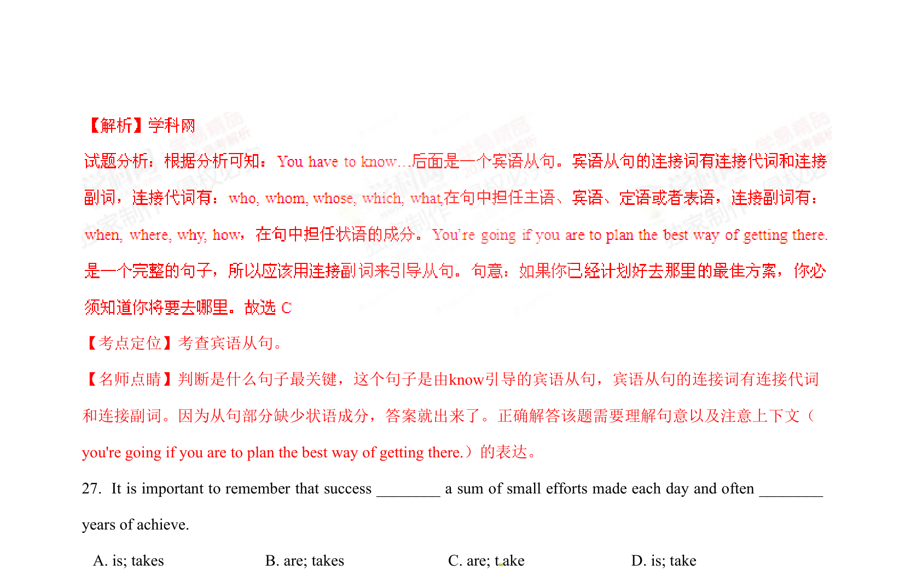

## 篇章题面

## 摘要

（待补）

## 关联考点

- [[1031-语篇填空|语篇填空]]
- [[1018-语法填空|语法填空]]

## 答案

`A 【考点定位】考查主谓一致原则 【名师点睛】本题旨在考查主谓一致原则，要求学生掌握这一原则和用法，确定句子主语的单复数，不要 受其他干扰项干扰而答错。主谓一致是指： 1） 语法形式上要一致，即单复数形式与谓语要一致。2） 意 义上要一致，即主语意义上的单复数要与谓语的单复数形式一致。 3） 就近原则，即谓语动词的单复形式 取决于最靠近它的词语， 一般来说，不可数名词用动词单数，可数名词复数用动词复数。 4）就远原则， 即谓语动词的单复形式取决于离它最远的词语， 一般来说，不可数名词用动词单数，可数名词复数用动词 复数。 28.He must have sensed that I ______`

## 解析

> 📄 原 PDF 第 9 页：`素材/真题/湖南/2008-2024·（湖南）英语高考真题/2015年高考英语试卷（湖南）（解析卷）.pdf`
