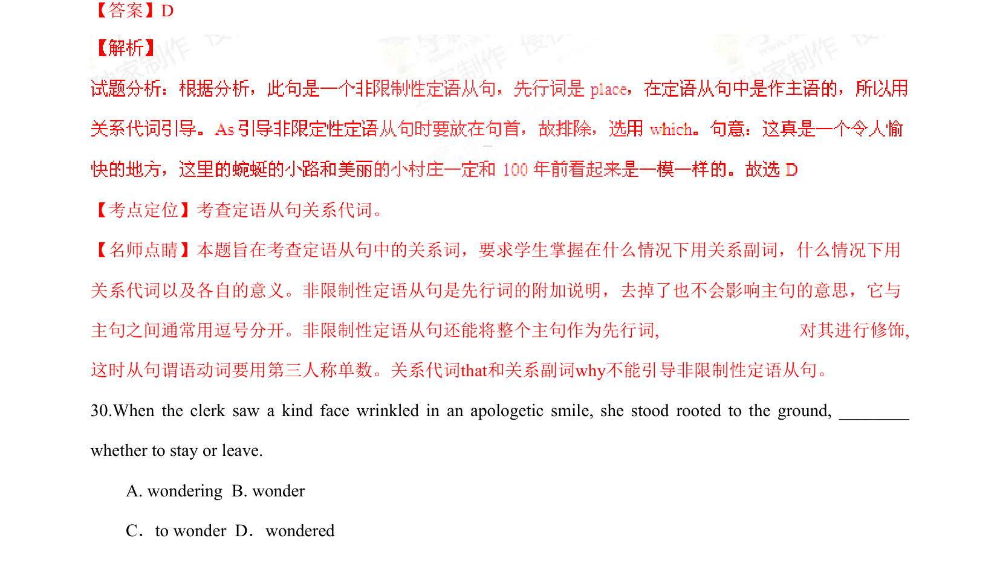

## 篇章题面

## 摘要

（待补）

## 关联考点

- [[1031-语篇填空|语篇填空]]
- [[1018-语法填空|语法填空]]

## 答案

`A 【考点定位】考查非谓语动词 【名师点睛】 非谓语形式有三种：1、动词不定式：to do 2、动词的ing : doing 3、 动词的过去分词：done;不定式：表示目的和将来；动词的ing：表示主动和进行；过去分词：表示被动和 完成。非谓语动词的做题步骤1、判定是否用非谓语形式。方法：看看句子中是否已有了谓语动词了;2、找 非谓语动词的逻辑主语。方法：非谓语动词的逻辑主语一般是句子的主语。3、判断主被动关系。方法： 非谓语动词与其逻辑主语的主动还是被动关系。4、判断时间关系。方法：分析句子，看看非谓语动词所 表示的动作发生在谓语动作之前、之后还是同时。之前常用 done; 之后常用to `

## 解析

> 📄 原 PDF 第 10 页：`素材/真题/湖南/2008-2024·（湖南）英语高考真题/2015年高考英语试卷（湖南）（解析卷）.pdf`
