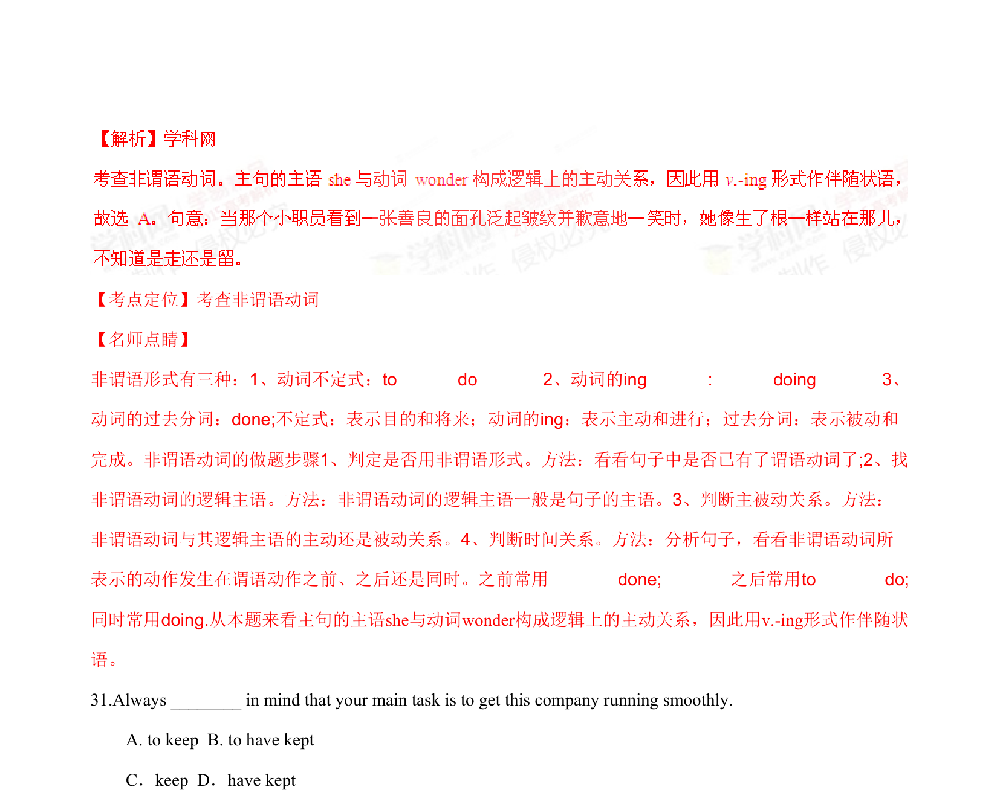
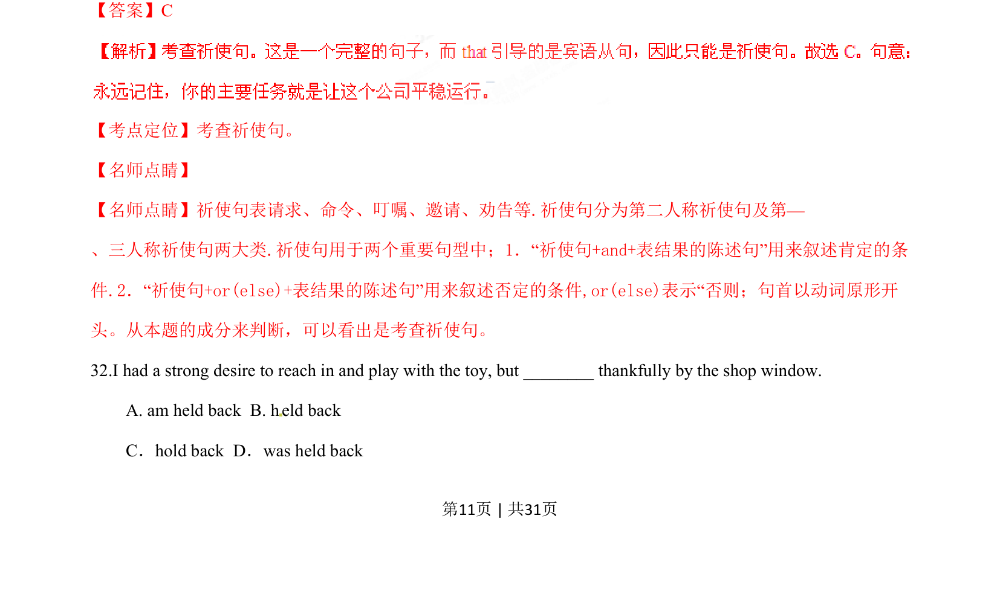

## 篇章题面

## 摘要

（待补）

## 关联考点

- [[1031-语篇填空|语篇填空]]
- [[1018-语法填空|语法填空]]

## 答案

`C 【考点定位】考查祈使句。 【名师点睛】 【名师点睛】祈使句表请求、命令、叮嘱、邀请、劝告等.祈使句分为第二人称祈使句及第— 、三人称祈使句两大类.祈使句用于两个重要句型中；1．“祈使句+and+表结果的陈述句”用来叙述肯定的条 件.2．“祈使句+or(else)+表结果的陈述句”用来叙述否定的条件,or(else)表示“否则；句首以动词原形开 头。从本题的成分来判断，可以看出是考查祈使句。 32.I had a strong desire to reach in and play with the toy, but ________ thankfully by the shop windo`

## 解析

> 📄 原 PDF 第 11 页：`素材/真题/湖南/2008-2024·（湖南）英语高考真题/2015年高考英语试卷（湖南）（解析卷）.pdf`
