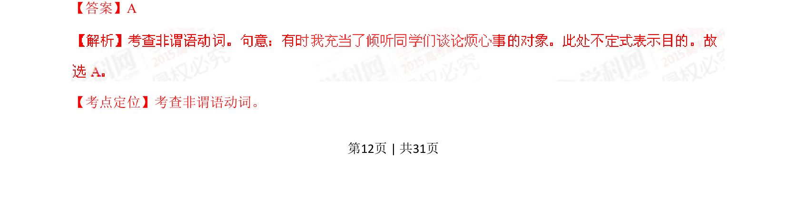

## 篇章题面

## 摘要

（待补）

## 关联考点

- [[1031-语篇填空|语篇填空]]
- [[1018-语法填空|语法填空]]

## 答案

`B 【考点定位】考查动词的时态。 【名师点睛】 【名师点睛】一般现在时:表示通常性、规律性、习惯性的状态或者动作（有时间规律发生的事件）的一种 时间状态；在一般现在时中,当主语是第三人称单数时,谓语动词要用第三人称单数形式,即常在动词原形后 加-s或- es.在本题目中，可以从这个角度来判断，主将从现是指在时间状语从句和条件状语从句中，如果主句是一 般将来时，从句用一般现在时替代一般将来时。比如：条件状语从句的主句是一般将来时，那么从句常常 用一般现在时 如： When I grow up, I’ll be a nurse and look after patients 我长大后要当一名护士，`

## 解析

> 📄 原 PDF 第 13 页：`素材/真题/湖南/2008-2024·（湖南）英语高考真题/2015年高考英语试卷（湖南）（解析卷）.pdf`
