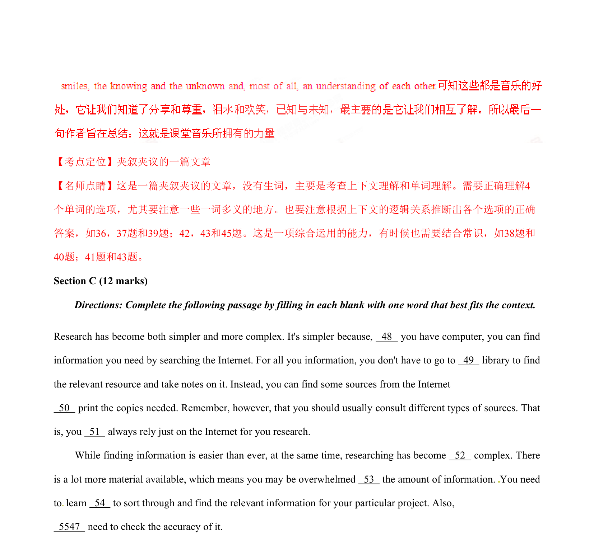

## 篇章题面

## 摘要

（待补）

## 关联考点

- [[1031-语篇填空|语篇填空]]
- [[1018-语法填空|语法填空]]

## 答案

`48．if 49．the 50．and 51．shouldn’t 52．more 53．with 54．how 55．you 【考点定位】科普类短文阅读。 【名师点睛】这种题目相当于语法填空，是语法填空和阅读理解的结合体。既对语法的要求很高，要求注 意上下文的，以及单词的用法，以及特殊用法、固定搭配等填出单词的正确形式也要理解全文，把握文章 的大意。这就要求学生能够记牢大纲中重要的单词个短语搭配，还要加强写作的练习，这些对于这种题目 ，是大有帮助的。另外，这种题目也可以改编一下，成为短文改错。 Part Ⅲ Reading Comprehension (30 marks)[来源:Z*xx*k.`

## 解析

> 📄 原 PDF 第 16 页：`素材/真题/湖南/2008-2024·（湖南）英语高考真题/2015年高考英语试卷（湖南）（解析卷）.pdf`
