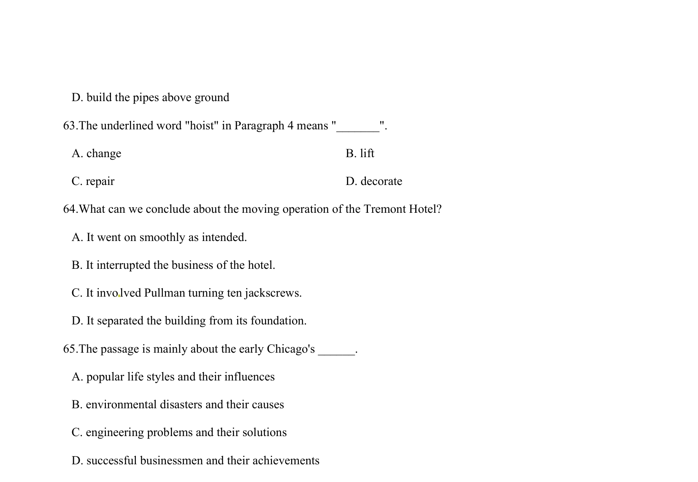

## 篇章题面

## 摘要

（待补）

## 关联考点

- [[724-reading comprehension|阅读理解]]
- [[689-Specific Information|细节理解]]
- [[887-推理判断|推理判断]]

## 答案

`56．C 57．B 58．B 59．D 60．A 【考点定位】社会现象类短文阅读。 【名师点睛】本文考查社会现象类短文阅读，要求考生根据作者的细节描述掌握这一社会现象的起因、结 果及影响，然后做题，进行归纳。这篇文章旨在给出了一个议题，让人们给出讨论，意见以及看法，要求 学生能够通过字里行间的细节描写找出人们对这个议题想法，例如第一段的第二句：But pedestrians are probably the worse offenders.就给出Michael Horan的看法，因此方便了我们做出第56题，所以在做这种文章时一定得抓住表达作者或者他人态度或观 点的句子。 B In its ea`

## 解析

> 📄 原 PDF 第 19 页：`素材/真题/湖南/2008-2024·（湖南）英语高考真题/2015年高考英语试卷（湖南）（解析卷）.pdf`
