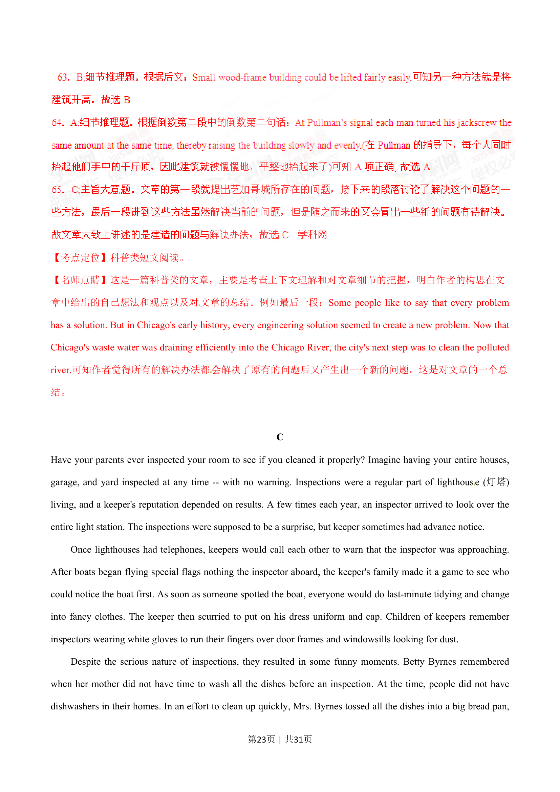
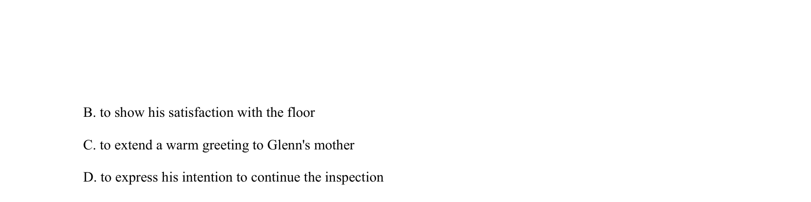
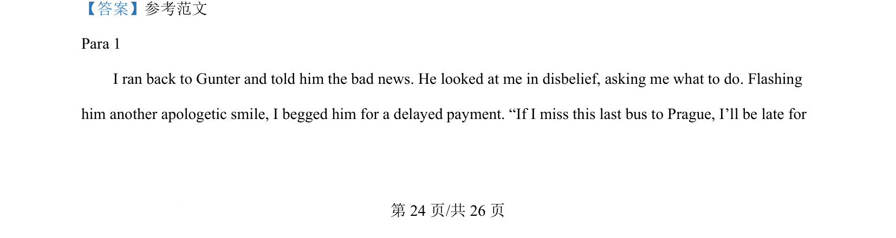
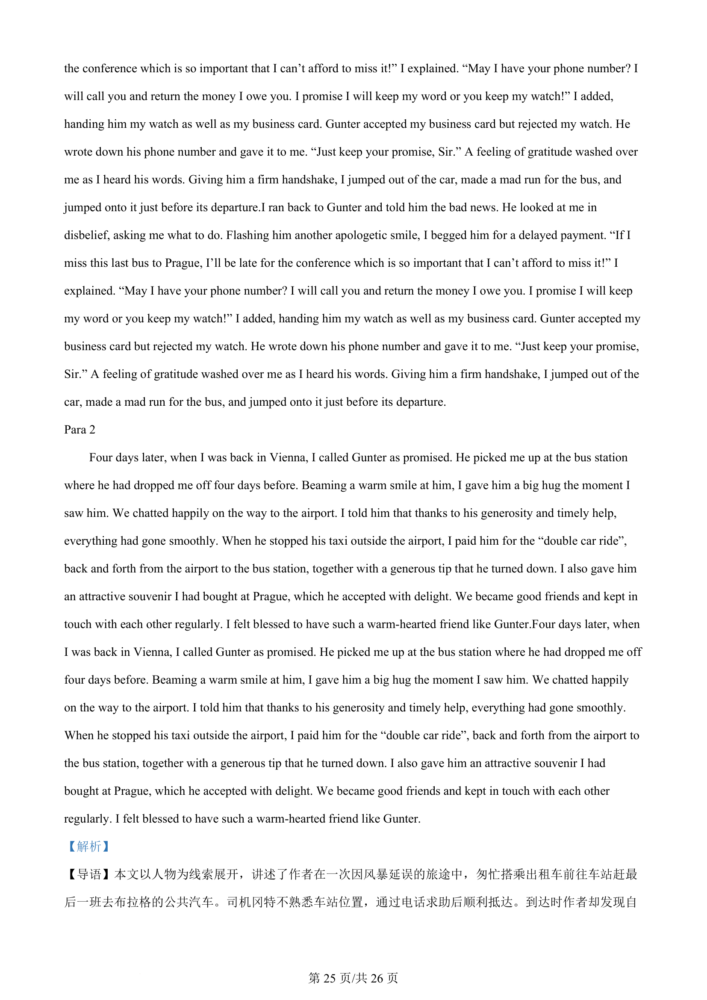
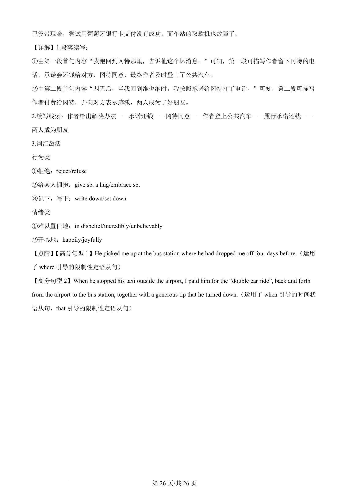

## 篇章题面

## 摘要

（待补）

## 关联考点

- [[996-书面表达|书面表达]]
- [[1007-应用文写作|应用文写作]]

## 答案

`66．C 67．A 68．C 69．D 70．A 【考点定位】社会生活类短文阅读。 【名师点睛】社会生活类的文章相对而言是比较容易做的，细节题占多数，需要的是一个细心。注意事情 发展的先后顺序和发展的情节，理清作者的思路，以此得出答案。有时可以找出原句，有时可能需要理解 ，根据前后文推断，进行一个一个选项匹配排除，最终得出最佳答案。 Part IV Writing (45 marks) Section A (10 marks) Directions: Read the following passage. Fill in the numbered blanks by using the inf`

## 解析

> 📄 原 PDF 第 25 页：`素材/真题/湖南/2008-2024·（湖南）英语高考真题/2015年高考英语试卷（湖南）（解析卷）.pdf`
