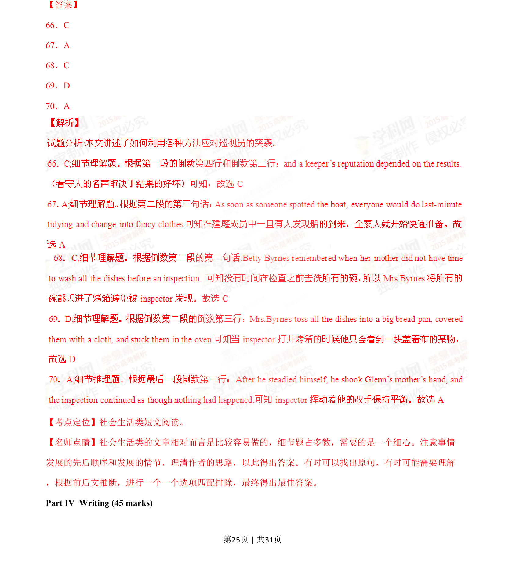
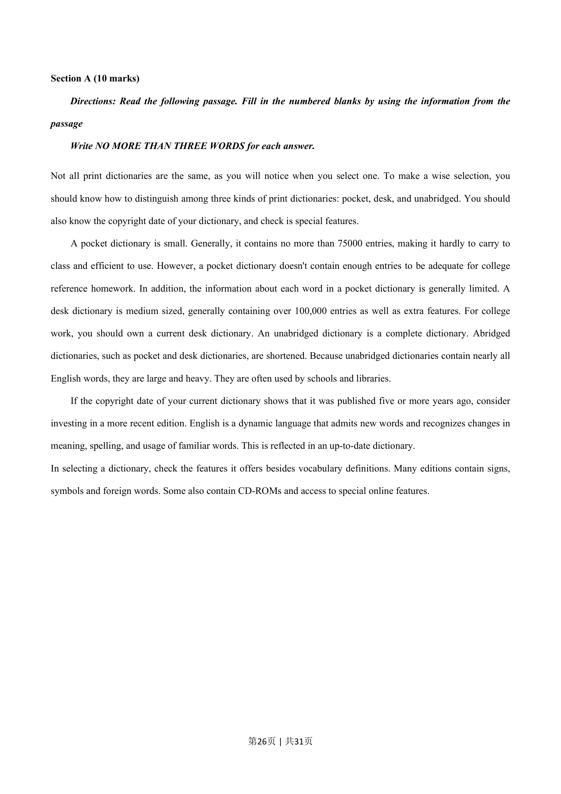
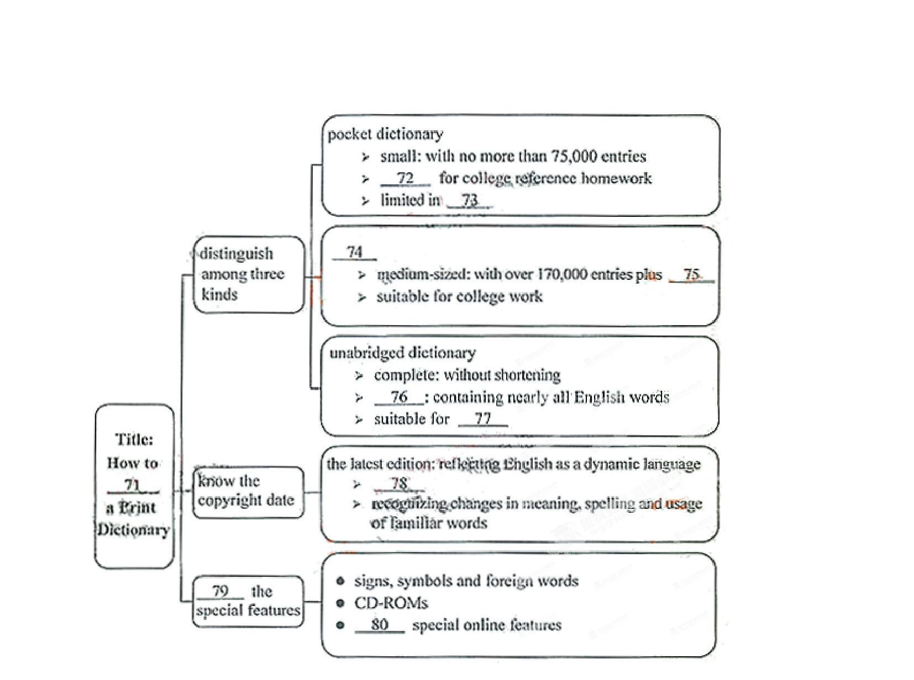
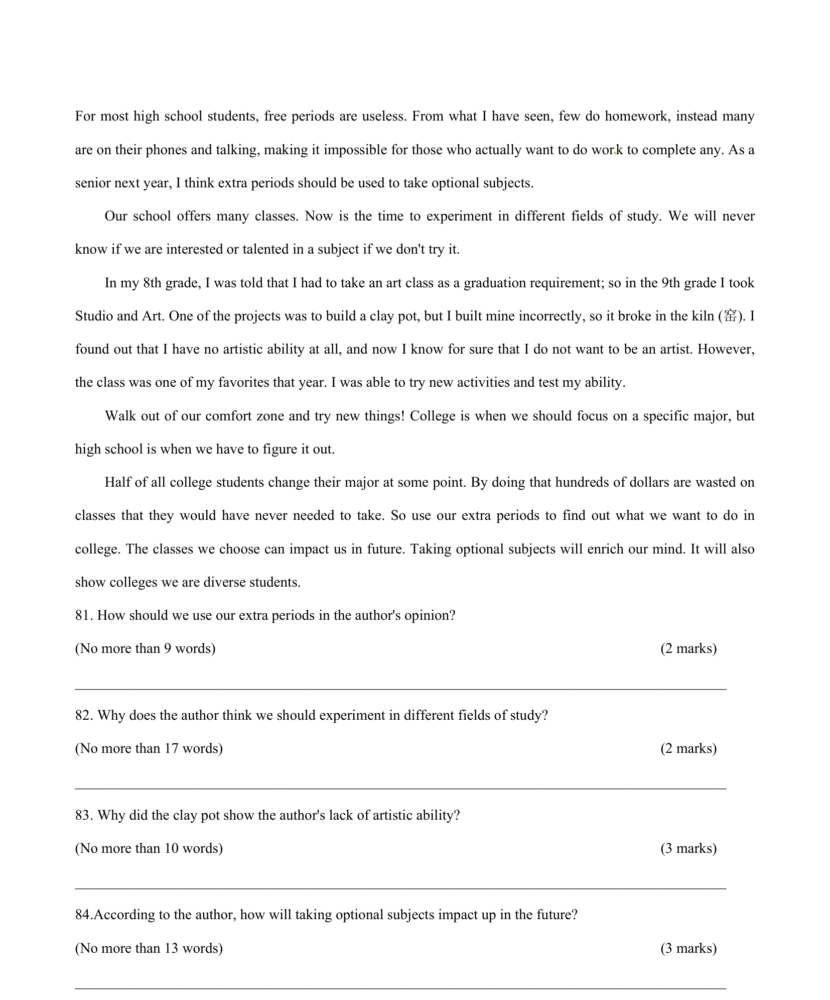

## 篇章题面

## 摘要

（待补）

## 关联考点

- [[996-书面表达|书面表达]]
- [[1007-应用文写作|应用文写作]]

## 答案

`71．Select 72．inadequate 73．word information 74．desk dictionary 75．extra features 76．large and heavy 77．schools and libraries 78．admitting new words 79．cheek 80．access to 【考点定位】生活类短文阅读。 【名师点睛】要求考生根据篇章内容和所给题目，进行快速阅读，锁定关键词。考查学生分清条理和查找 关键词的能力。这种题目的难度不大，需要根据正确理解文章所说的内容，确定关键句子，找出关键词。 有时也需要因为所填内容的限制，将关键词变形`

## 解析

> 📄 原 PDF 第 27 页：`素材/真题/湖南/2008-2024·（湖南）英语高考真题/2015年高考英语试卷（湖南）（解析卷）.pdf`
