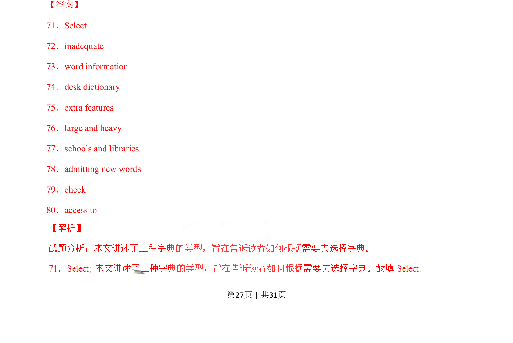
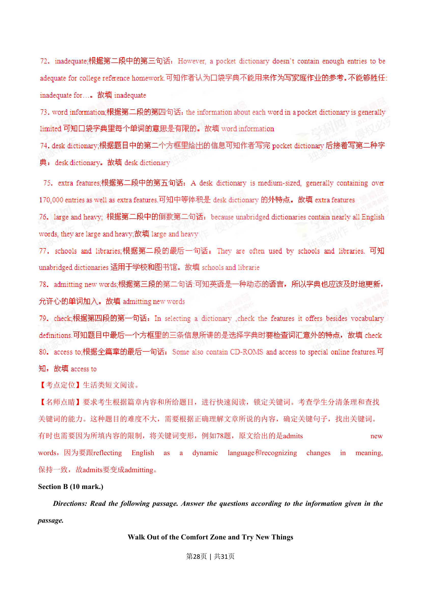
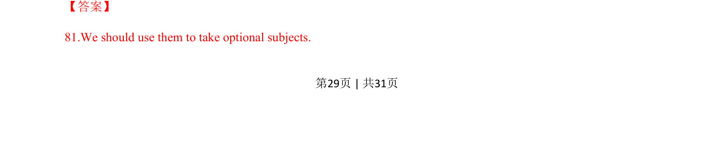
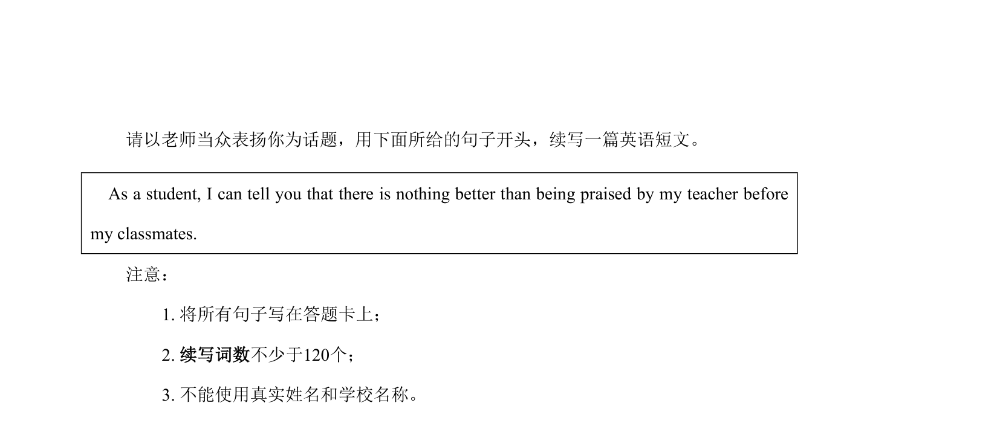

## 篇章题面

## 摘要

（待补）

## 关联考点

- [[1032-阅读表达|阅读表达]]
- [[1030-信息归纳|信息归纳]]

## 答案

`81.We should use them to take optional subjects. 82.We will never know if we are interested or talented in a subject without trying it. 83.It was built incorrectly and broke in the kiln. 84.It will enrich our mind and show colleges we are diverse students. 【考点定位】人生哲理类短文阅读。 【名师点睛】这种有关人生类的哲理性短文，夹叙夹议，一`

## 解析

> 📄 原 PDF 第 29 页：`素材/真题/湖南/2008-2024·（湖南）英语高考真题/2015年高考英语试卷（湖南）（解析卷）.pdf`
