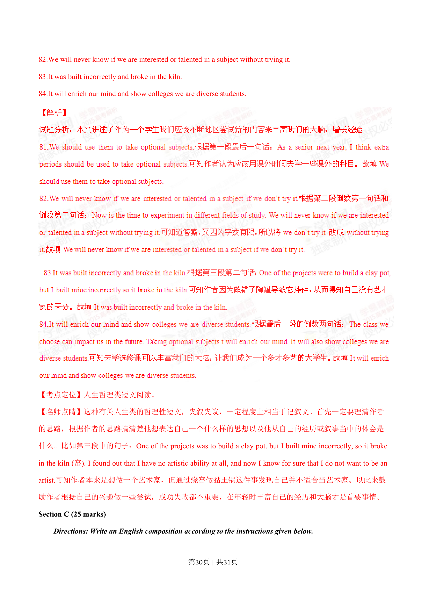
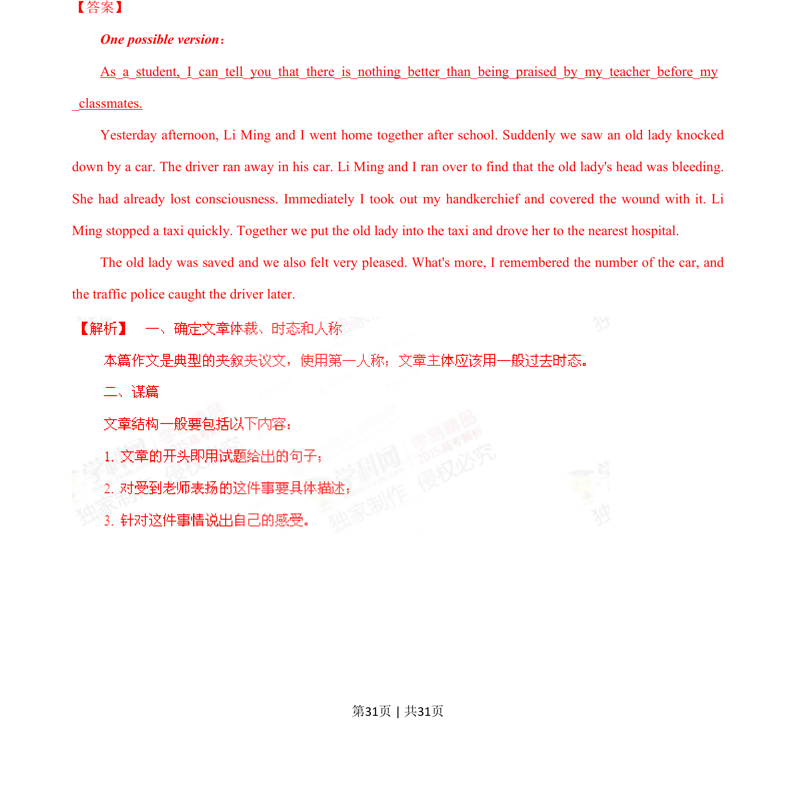

## 篇章题面

## 摘要

（待补）

## 关联考点

- [[996-书面表达|书面表达]]
- [[1007-应用文写作|应用文写作]]

## 答案

`One possible version： As_a_student,_I_can_tell_you_that_there_is_nothing_better_than_being_praised_by_my_teacher_before_my _classmates. Yesterday afternoon, Li Ming and I went home together after school. Suddenly we saw an old lady knocked down by a car. The driver ran away in his car. Li Ming and I`

## 解析

> 📄 原 PDF 第 31 页：`素材/真题/湖南/2008-2024·（湖南）英语高考真题/2015年高考英语试卷（湖南）（解析卷）.pdf`
